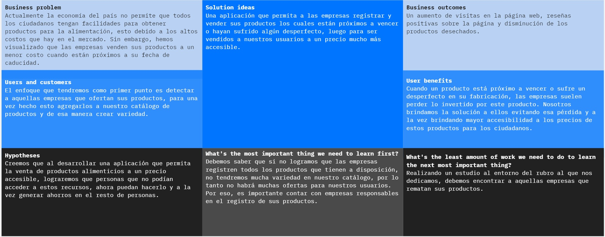

<h1 style="text-align: center;"> Informe del TB1  </h1>
<h2 style="text-align: center;"> Universidad Peruana de Ciencias Aplicadas </h2>

  

<h4 style="text-align: center;"> Ingeniería de Software </h4>
<h4 style="text-align: center;">Desarrollo de Aplicaciones Open Source</h4>
<h4 style="text-align: center;"> Ciclo 2024-01 </h4>
<h4 style="text-align: center;"> WS52</h4>
<h4 style="text-align: center;"> Docente: Elio Jefferson Navarrete Vilca </h4>
<h4 style="text-align: center;"> Startup:  ProDev</h4>
<h4 style="text-align: center;"> Producto: EcoMarket</h4>

## Team Members
|              Nombre               | Código de alumno |
|:---------------------------------:|:----------------:|
|                                   |                  |
|  Quispe Condori, Fernando Daniel  |    U20221C628    |
|  Cortes Hidalgo, Nicolas Andres   |    U202016311    |
| Salazar Saldarriaga, Frank Junior |    U20181H103    |
|Macedo Calsina, Anderson Walter    |    U20201C179    |

## Registro de versiones del informe
|   Fecha    | Versión |      Autor      |              Descripción de modificación               |
|:----------:|:-------:|:---------------:|:------------------------------------------------------:|
| 01/04/2024 |   1.0   | Quispe Fernando | Creación de nuestro repositorio e inicio en capítulo 1 |
| 08/04/2024 |   1.1   |  Salazar Frank  |          Actualizació del informe capitulo 1           |

## Project Report Collaboration Insights

URL del repositorio del proyecto:

**TB1**

|            Integrante             |                                                           Tareas Asignadas                                                           |
|:---------------------------------:|:------------------------------------------------------------------------------------------------------------------------------------:|
|  Quispe Condori, Fernando Daniel  |                                     Elaboración Preguntas de Entrevitas - Artefactos Capítulo 2                                      |
|  Cortes Hidalgo, Nicolas Andres   | Elaboracion de los Emphaty maps, As-Is y To-Be Scenario Mapping, Ubiquitous Langiage, User Stories, Impact Mapping y Product Backlog |
| Salazar Saldarriaga, Frank Junior |                            Startup Profile, Solution Profile, Lean UX, Segmentos Objetivos, Landing Page                             |

***TB1 Github***

## Contenido
1. [**Capítulo I: Introducción.**](#1.)  
   1.1. [***Startup Profile***](#1.1.)  
   1.1.1. [Descripción del startup](#1.1.1.) 
   1.1.2.[Perfiles de los integrantes del equipo](#1.1.2.) 
   1.2. [***Solution Profile***](#1.2.) 
   1.2.1. [Antecedentes y Problemática](#1.2.1.) 
   1.2.2. [Lean UX Process](#1.2.2.) 
   1.2.3. [Lean UX Problem Statements](#1.2.3.) 
   1.2.4. [Lean UX Assumptions](#1.2.4.) 
   1.2.5. [Lean UX Hypothesis Statements](#1.2.5.) 
   1.2.6. [Lean UX Canvas](#1.2.5.) 
   1.3. [***Segmentos objetivo***](#1.2.6.) 
2. [**Capítulo II: Requirements Elicitation & Analysis**](#2.) 
   2.1. [***Competidores***](#2.1.) 
   2.1.1. [Análisis competitivo](#2.1.1.) 
   2.1.2. [Estrategias y tácticas frente a competidores](#2.1.2.) 
   2.2. [***Entrevistas***](#2.2.) 
   2.2.1. [Diseño de entrevistas](#2.2.1.) 
   2.2.2. [Registro de entrevistas](#2.2.2.) 
   2.2.3. [Análisis de entrevistas](#2.2.3.) 
   2.3. [***Needfinding***](#2.3.) 
   2.3.1. [User Personas](#2.3.1.) 
   2.3.2. [User Task Matrix](#2.3.2.) 
   2.3.3. [User Journey Mapping](#2.3.3.) 
   2.3.4. [Empathy Mapping](#2.3.4.) 
   2.3.5. [As-is Scenario Mapping](#2.3.5.) 
   2.4. [***Ubiquitous Language***](#2.4.) 
3. [**Capítulo III: Requirements Specification**](#3.) 
   3.1. [***To-Be Scenario Mapping***](#3.1.) 
   3.2. [***User Stories***](#3.2.) 
   3.3. [***Impact Mapping***](#3.3.) 
   3.4. [***Product Backlog***](#3.4.) 
4. [**Capítulo IV: Product Design.**](#4.) 
   4.1. [***Style Guidelines***](#4.1.) 
   4.1.1. [General Style Guidelines](#4.1.1.) 
   4.1.2. [Web Style Guidelines](#4.1.2.) 
   4.2. [***Information Architecture***](#4.2.) 
   4.2.1. [Organization Systems](#4.2.1.) 
   4.2.2. [Labeling Systems](#4.2.2.) 
   4.2.3. [SEO Tags and Meta Tags](#4.2.3.) 
   4.2.4. [Searching Systems](#4.2.4.) 
   4.2.5. [Navigation Systems](#4.2.5.) 
   4.3. [***Landing Page UI Design***](#4.3.) 
   4.3.1. [Landing Page Wireframe](#4.3.1.) 
   4.3.2. [Landing Page Mock-up](#4.3.2.) 
   4.4. [***Web Applications UX/UI Design***](#4.4.) 
   4.4.1. [Web Applications Wireframes](#4.4.1.) 
   4.4.2. [Web Applications Wireflow Diagrams](#4.4.2.) 
   4.4.3. [Web Applications Mock-ups](#4.4.3.) 
   4.4.4. [Web Applications User Flow Diagrams](#4.4.4.) 
   4.5. [***Web Applications Prototyping***](#4.5.) 
   4.6. [***Domain-Driven Software Architecture***](#4.6.) 
   4.6.1. [Software Architecture Context Diagram](#4.6.1.) 
   4.6.2. [Software Architecture Container Diagrams](#4.6.2.) 
   4.6.3. [Software Architecture Components Diagrams](#4.6.3.) 
   4.7. [***Software Object-Oriented Design***](#4.7.) 
   4.7.1. [Class Diagrams](#4.7.1.) 
   4.7.2. [Class Dictionary](#4.7.2.) 
   4.8. [***Database Design***](#4.8.) 
   4.8.1. [Database Diagram](#4.8.1.) 
5. [**Capítulo V: Product Implementation, Validation & Deployment**](#5.) 
   [**Conclusiones**](#Conclusiones) 
    - [**Conclusiones y recomendaciones**](#ConclusionesYrecomendaciones)

   [**Bibliografía**](#Bibliografia) 
   [**Anexos**](#Anexos) 

## Student Outcome
El curso contribuye al cumplimiento del Student Outcome ABET:
<b>ABET – EAC - Student Outcome 3</b>

**Criterio:** Capacidad de comunicarse efectivamente con un rango de audiencias.
En el siguiente cuadro se describe las acciones realizadas y enunciados de
conclusiones por parte del grupo, que permiten sustentar el haber alcanzado el logro
del ABET – EAC - Student Outcome 3

| Criterio especifico                                                                                                                                                                | Acciones realizadas                                                                                                                                                | Conclusiones                                                                                                                                                                                                                                                                             |
|------------------------------------------------------------------------------------------------------------------------------------------------------------------------------------|:-------------------------------------------------------------------------------------------------------------------------------------------------------------------|------------------------------------------------------------------------------------------------------------------------------------------------------------------------------------------------------------------------------------------------------------------------------------------|
| Comunica oralmente sus ideas y/o resultados con objetividad a público de diferentes especialidades y niveles jerarquicos, en el marco del desarrollo de un proyecto en ingeniería. | <b>Quispe Condori, Fernando Daniel</b>  TB1: Desarrollo del vídeo de exposición comunicando las ideas de nuestros artefactos.     **Cortez, Nicolas** TB1: | **TB1:** En esta entrega pudimos concluir que el desarrollar nuestros artefactos para el análisis de los requisitos de nuestra idea de software, no solo basta con tenerlo en un informe. Tenemos que comunicarlo y explicarlo para que una audiencia general pueda entender claramente. |
| Comunica en forma escrita ideas y/o resultados con objetividad a público de diferentes especialidades y niveles jerarquicos, en el marco del desarrollo de un proyecto en ingeniería. | <b>Quispe Condori, Fernando Daniel</b>  TB1: Desarrollo artefactos Needfinding y Diagramas de clases y datos.     **Cortez, Nicolas** TB1:                 | **TB1:** Tenemos cómo conclusión que nuestros artefactos de obtenciónde requisitos tienen que también enfocarse al público en general, ya sea con distintas especialidades por ejemplo. Para una correcta comunicación entre todos y llevar el proyecto de forma satisfactoria.          |

<h2>Capítulo I: Introducción</h2>

<h3> 1.1 Startup Profile</h3>

En esta sección se presenta la descripción de nuestra startup "Pro Dev" y los perfiles de los miembros del equipo.
En el Perú, se estima que se desperdician aproximadamente 13 millones de toneladas en alimentos anualmente. Se estima que el 28% de las pérdidas ocurren en la etapa del procesamiento de los alimentos y el 25% en la etapa agrícola.
Se ha podido observar que muchas empresas dedicadas a la industria alimentaria suelen vender sus productos a precios cómodos cuando están cerca de su fecha de vencimiento al pie de las puertas de su fábrica. Este es un ejemplo claro de aquellos productos almacenados hasta caducar y, en reiteradas ocasiones, debido a la desinformación, no se llegan a tomar los cuidados debidos, lo que genera pérdidas millonarias a las empresas.

<h4> 1.1.1. Descripción del startup</h4>

ProDev, es una startup la cual se enfoca en vender productos de calidad a precios altamente accesibles. Nuestra empresa nace debido a la gran preocupación por el desperdicio de alimentos a nivel nacional. Hemos buscado abordar dicho problema desarrollando una aplicación la cual permite a nuestros clientes la compra de productos de supermercados o negocios a precios altamente accesibles, esto tomando en cuenta que los productos están cerca a su fecha de vencimiento y de tal manera evitando el desperdicio de estos alimentos. El desarrollo de nuestra aplicación contará con una atractiva e intuitiva interfaz, como a la vez contará con un catálogo variado de centros comerciales y empresas, asegurándonos de que el cliente cuente con la mayor diversidad de productos posible.

**Misión:** Poder ofrecer un servicio de excelente calidad a nuestros clientes y a la vez mantener la alta calidad en nuestros productos. 

**Visión:** Ser líderes a nivel nacional en la venta y distribución de productos con precios accesibles y a la vez con gran calidad, buscando lograr más de 10,000 de ventas al mes.

##### Logotipo de la Startup: 

##### Logotipo del producto

<h4> 1.1.2. Perfiles de los integrantes del equipo</h4>

|                                                                                                                                                                                                                                      Descripción de los perfiles de los integrantes del equipo                                                                                                                                                                                                                                       |                            Foto del integrante                             |
|:------------------------------------------------------------------------------------------------------------------------------------------------------------------------------------------------------------------------------------------------------------------------------------------------------------------------------------------------------------------------------------------------------------------------------------------------------------------------------------------------------------------------------------:|:--------------------------------------------------------------------------:|
|                                                                    Mi nombre es Fernando Quispe, soy una persona proactiva que puede aportar y liderar la colaboración en equipo con el objetivo de un logro común. Me gusta el desarrollo de software y poder contribuir a la sociedad con lo que me apasiona. Tengo como meta adquirir los conocimientos de una manera clara para poder aplicarlos en los distintos proyectos tal cuál como el proyecto actual.                                                                    |                                                                              |
| Mi nombre es Nicolas Cortes, tengo 21 años y estudio la carrera de Ingenieria de Software en la Universidad Peruana de Ciencias Aplicadas. Soy una persona responsable y proactiva que siempre busca ayudar en todo lo posible a su grupo para lograr terminar cualquier tipo de trabajo o actividad de la forma mas rapida y presentable posible. Mi meta al terminar este curso es lograr entender todos los conceptos nuevos que sean necesarios para posteriormente aplicarlos mas adelante en mi carrera y en el mundo laboral. |  
|                                                                 Mi nombre es Frank Junior Salazar Saldarriaga, tengo 23 años y estudio la carrera de Ingeniería de Software en la UPC. Soy una persona autodidacta, proactiva y desarrolladora del trabajo en equipo, a la cual le gusta el hecho de poder crear cosas nuevas que tengan un impacto en las personas. Mi meta al terminar el curso es dominar cada uno de los lenguajes que se ven durante el curso.                                                                  | 
| 
Mi nombre es Anderson Walter Macedo Calsina, tengo 22 años y soy estudiante de la carrera de ing de software en la UPC. Me gusta ayudar a los demás y colaborar para un trabajo en conjunto. Estoy dispuesto a esforzarme y estar comprometido en mis cursos y actividades designadas, orientando las soluciones a las diversas propuestas.                                |                                       |
|                                                                                                                                                                                                                                                                                                                                                                                                                                                                                                                                      |                                                                            |
 

<h3> 1.2. Solution Profile</h3>

EcoMarket ofrece una óptima solución con el objetivo de lograr reducir el desperdicio de alimentos y permitir el ingreso adicional a aquellas empresas que ya contaban con los egresos que generarían el desperdicio de sus productos. Nuestros clientes podrán acumular puntos por cada compra exitosa realizada, los cuales les permitirán obtener descuentos en futuras ventas. Las empresas tendrán opciones como la publicación de sus productos y un registro de ventas para cada uno de ellos. EcoMarket obtendrá ganancias a través de una comisión por cada venta exitosa realizada. Por estos motivos se propone a EcoMarket como solución para reducir el desperdicio innecesario de alimentos y con ello realizar un negocio sostenible mediante la venta de estos.

<h4> 1.2.1. Antecedentes y Problemática</h4>

##### What (Qué)
La falta de acceso a productos vitales por parte de las familias peruanas en estado de pobreza y la preocupación por reducir el desperdicio de alimentos tanto por parte de empresas, como de los vendedores
##### When (Cuando)
Este problema inicia desde hace ya muchos años, debido al desconocimiento de soluciones para lograr la venta de productos con su fecha de vencimiento próxima.
##### Where (Dónde)
###### ¿Dónde surge el problema?
El problema se puede encontrar en empresas y bodegas las cuales se dedican al rubro de ventas de productos alimenticios.
##### Who (Quién)
Familias peruanas que se encuentran en la pobreza y pobreza extrema y, por el lado empresarial, aquellas empresas que no encuentran soluciones para evitar la pérdida generada por el desperdicio de estos productos.
##### Why (Por qué)
Porque en la actualidad la falta de accesibilidad debido a los precios excesivos en los productos va en crecimiento. Por el lado empresarial, el desconocimiento de soluciones para evitar las pérdidas económicas debido al desperdicio de estos alimentos.

### 2H
##### How (Cómo)
###### ¿Cómo se utilizará el producto?
El problema surge en el momento en el que las bodegas o supermercados no logran vender sus productos y estos ya se encuentran próximos a vencer.
##### How much (Cuánto)
###### ¿Cuál es la magnitud del problema?
La magnitud del problema es considerable, con comerciantes sufriendo grandes pérdidas al no poder vender sus productos. El fenómeno de esperar rebajas para realizar compras se intensifica, con un 63,5% de consumidores aguardando ofertas para adquirir productos cercanos a su vencimiento, resaltando la necesidad de implementar soluciones que beneficien tanto a consumidores como a comerciantes, según SaleCycle.

Este escenario subraya la importancia de desarrollar e implementar políticas y estrategias enfocadas tanto en la accesibilidad a alimentos para las familias en situación de vulnerabilidad como en la optimización de procesos por parte de las empresas para minimizar el desperdicio de alimentos, generando un impacto positivo tanto social como económico.

<h4> 1.2.2. Lean UX Process</h4>

<h5> 1.2.2.1. Lean UX Problem Statements</h5>

##### **Problem Statement:**

###### **Ciudadanos peruanos**
El alto costo de los alimentos coloca a muchas personas de bajos ingresos en una situación difícil porque no pueden afrontar los precios actuales. Aunque algunas empresas venden productos cercanos a su fecha de vencimiento con descuentos, no todos los residentes tienen acceso a estas ofertas.

¿Cómo podemos reducir el desperdicio de alimentos ayudando a las personas de bajos ingresos a obtener alimentos a precios más bajos y garantizando al mismo tiempo la seguridad alimentaria?

###### **Empresas peruanas**
El alto costo de los alimentos ha reducido las ventas de algunas empresas, ya que los consumidores prefieren opciones más baratas. Además, muchos de estos productos se almacenan hasta que caducan y finalmente se desechan, lo que cuesta dinero a las empresas.

¿Cómo ayudamos a las empresas a reducir el desperdicio de alimentos y aumentar las ganancias para que puedan vender estos productos a precios más bajos y hacerlos accesibles a los consumidores?

<h5> 1.2.2.2. Lean UX Assumptions</h5>

##### **Business Assumptions:**
1. *Creo que mis clientes tienen la necesidad de adquirir productos alimenticios de calidad a precios accesibles.*
2. *Estas necesidades se pueden resolver con una aplicación en donde encuentres estos productos a un precio más accesible de lo cotidiano.*
3. *Mis clientes iniciales serán personas que no cuentan con el dinero para la compra de productos alimenticios.*
4. *El valor número 1 que un cliente quiere obtener de mi producto es adquirir una variedad de productos alimenticios a buen precio.*
5. *Obtendré la mayoría de mis clientes a través de recomendaciones y publicidad en redes sociales.*
6. *Voy a ganar dinero por comisiones en cada venta.*
7. *Mi principal competencia en el mercado serán las grandes empresas con sus propios descuentos.*
8. *Los venceremos debido a nuestra variedad de productos y amplio catálogo de supermercados.*
9. *Mi mayor riesgo es la poca variedad o la limitada cantidad de productos.*
10. *Resolveremos esto a través de Recomendar el mismo producto pero de una marca diferente a la que nuestros usuarios quieren comprar.*
11. *Sabremos que tenemos éxito cuando veamos los siguientes cambios en el comportamiento del cliente: Han aumentado las compras de diversos productos que ofrecemos.*

##### **User Assumptions:**
###### **¿Quién es el usuario?** 
Personas que no cuentan con los suficientes recursos.

###### **¿Qué problemas resuelve nuestro producto?**
Resuelve el problema de la mala alimentación de las personas por no tener los recursos suficientes para acceder a los productos alimenticios. También resuelve el problema de la pérdida de dinero de las empresas por el desperdicio de estos productos.

###### **¿Qué características son importantes?**
Poder adquirir el producto que necesitemos desde cualquier punto a precios totalmente accesibles.

###### **¿Dónde encaja nuestro producto en su trabajo o vida?** 
En su día a día

###### **¿Cuándo y cómo es nuestro producto usado?**
Siempre que necesiten productos alimenticios a precios totalmente accesibles, tan solo ingresando a la aplicación.

###### **¿Cómo debe verse nuestro producto y cómo debe comportarse?**
Intuitivo, funcional y eficaz, donde el usuario de forma rápida y sencilla realice sus pedidos y sin mayor complicación también el pago.

<h5> 1.2.2.3. Lean UX Hypothesis Statements.</h5>

* **Hypothesis Statement 01:**

###### Usuario Cliente
  **Creemos que**, al desarrollar una aplicación en dónde se pueda encontrar productos alimenticios a precios considerablemente más accesibles

  **Lograremos**, apoyar a aquellos ciudadanos que no cuentan con los recursos suficientes para acceder a estos productos

  **Sabremos que hemos tenido éxito**, cuando la cantidad de productos vendidos de forma exitosa se haya incrementado en un 40% con respecto a los tres primeros meses de lanzada la aplicación.

###### Usuario Empresa
**Creemos que**, al comprar los productos que están próximos  a su fecha de caducidad o tuvieron defectos en el empaquetado.

**Lograremos**, evitar desechar estos alimentos y a la vez evitaremos las grandes pérdidas que esto provocaba para las empresas.

**Sabremos que hemos tenido éxito**, cuando la totalidad de los productos adquiridos hayan sido vendidos de manera exitosa.

<h5> 1.2.2.4. Lean UX Canvas</h5>

#### ***Lean UX Canvas:***

Se presenta el artefacto realizado Lean UX Canvas. La cuál nos ayuda a tener una visión general de nuestro producto y cómo se llevará a cabo.

<h3> 1.3. Segmento objetivo</h3>

En esta sección, se presentan los segmentos objetivo de nuestro producto EcoMarket.

- **SEGMENTO CLIENTES:** Personas que adquieren productos a través de nuestra plataforma. Nos enfocamos en estas personas ya son ellas las que adquirirán los productos de las empresas a bajo costo mediante nuestra solución. **_Ellos tienen la necesidad de comprar productos a bajo coste._**
- **SEGMENTO EMPRESAS:** Personas que venden productos a través de nuestra plataforma. Nos enfocamos en estas personas ya que son ellas las que ofrecerán sus productos a través de nuestra plataforma al tener productos defectuosos y/o próximos a vencer. **_Ellos tienen la necesidad de vender productos que están próximos a vencer para evitar pérdidas._**

[//]: #CAPITULO2

<h2> Capítulo II: Requirements Elicitation & Analysis</h2>

<h3> 2.1. Competidores</h3>
Tras nuestra idea de solución, nos podemos enfrentar a soluciones ya existentes en el mercado con el mismo propósito y/o algunas características similares. Por ello, es importante conocer a nuestros competidores y analizar sus estrategias y tácticas.

Teniendo cómo principales competidores a:

- Sugo
- Save Up
- Good After

<h4> 2.1.1. Análisis competitivo</h4>

En esta sección detallaremos en el siguiente cuadro a continuación detalles entre nuestros 3 competidores.

Imagen: Cuadro de Analisis entre competidores principales.

  
<h4> 2.1.2. Estrategias y tácticas frente a competidores</h4>

Teniendo en cuenta el análisis anterior de nuestros competidores podemos definir las siguientes estrategias para poder sobresalir sobre ellos.

- <b>Identificar las debilidades de la competencia y ser los mejores:</b> Esta estretegia será muy útil para marcar sobre todo nuestro valor agregado, 
cómo es el caso de mejores descuentos y/o alianzas con distintas compañias. Incrementando por ejemplo la relación con donaciones.
- <b>Publicidad y Marketing:</b> Incrementaremos en nuestra fase inicial esta característica para poder llegar a más personas y así poder tener un mayor alcance. Alianzas con otras compañías
y promociones diferenciadas para cada sector de nuestro público objetivo.
- <b>Mejor análisis de mercado:</b>Nuestros competidores se han enfocado en un solo sector de la población, nosotros nos enfocaremos en la diversidad de la población, ofreciendo diversos productos
ya que contaremos con muchas alianzas que nos ayudarán a tener un mayor alcance.
- <b>Diversidad en nuestras plataformas: </b> Estaremos activos en distintas redes sociales y nuestra plataforma web será excelente ya que brindará características
que los usuarios necesitan y un funcionamiento providencial.

  
<h3> 2.2. Entrevistas</h3>

  
<h4> 2.2.1. Diseño de entrevistas</h4>

  
En esta sección se procederá a detallar las preguntas para el método de recoleccion de
  requisitos que son las entrevistas. Para la formulación se siguieron buenas prácicas tales como 
  formulación de preguntas abiertas, así mismo obtenemos características demográficas con las entrevistas
  

  A continuacion se presentan las preguntas para el sector de Clientes

1. ¿Nos podrías brindar por favor tu nombre, edad, ocupación, nivel de ducación y nivel aproximado de ingresos?
2. ¿Dónde resides actualmente?
3. ¿Cuál es tu principal motivo para comprar productos en línea?
4. ¿Qué tipo de productos sueles comprar en línea?
5. ¿Has sido afectado por la crisis económica, perdiendo tu capacidad de adquisición?
6. ¿Qué tan importante es para ti la calidad de los productos que compras?
7. ¿Buscas productos de calidad o buscas productos a precios bajos?
8. ¿Crees que una plataforma web de compra de productos a punto de vencer y/o defectos te serían útil?
9. ¿Qué tan importante es para ti la fecha de vencimiento de los productos que compras?

A continuacion se presentan las preguntas para el sector de Empresas

1. ¿Nos podrías brindar por favor tu nombre, edad, ocupación, nivel de ducación y su empresa y/o tienda?
2. ¿Dónde resides actualmente?
3. ¿Cuál es tu principal motivo para vender productos?
4. ¿Qué tipo de productos sueles vender en línea y presencialmente?
5. ¿Has sido afectado por la crisis económica, perdiendo ventas?
6. ¿Que quejas obtiene con frecuencia de sus cliente?
7. ¿Alguna vez compró un producto y la venta no fue la esperada?
8. Si es así, ¿Qué hizo con el producto?
9. ¿Que le parece la idea de vender productos a punto de vencer y/o defectos a un precio más bajo a través de nuestra plataforma? 
10. En algunos casos, ¿Le llamaría la atención la contribución de ciertos para donaciones?

  
<h4> 2.2.2. Registro de entrevistas</h4>

  
<h4> 2.2.3. Análisis de entrevistas</h4>

  
<h3> 2.3. Needfinding</h3>

  <h4>2.3.1 User Persona</h4>
  A continuación se presentan las User Personas para nuestro producto. En base a nuestros dos segmentos objetivos definidos. Se realizaron los artefactos en la herramienta UXPressia.

   - Segmento Clientes: Personas que adquieren productos a través de nuestra plataforma.
   - Segmento Empresas: Personas que venden productos a través de nuestra plataforma.

   User Persona de Cliente: Click [aquí](https://uxpressia.com/w/ezex3/p/uLv62) para ver la User Persona de Cliente
      

   User Persona de Empresa: Click [aquí](https://uxpressia.com/w/ezex3/p/WoZAm) para ver la User Persona de Empresa
      
  <h4>2.3.2 User Task Matrix</h4>
  A continuación se presenta el User Task Matrix con las tareas de los usuarios y la importancia y frecuencia para cada usuario.

   Se presenta para el segmento de clientes:

| Tareas de los usuarios                | Importancia | Frecuencia |
|---------------------------------------|-------------|------------|
| Buscar los productos que va a comprar | Alta        | Alta       |
| Buscar las mejores ofertas            | Alta        | Alta       |
| Realizar el pago de los productos     | Baja        | Media      |
| Verificar la calidad de los productos | Baja        | Media      |
| Verificar la fecha de vencimiento     | Media       | Media      |
| Verificar la reputación de la empresa | Media        | Media       |

Se presenta para el segmento de empresarios:

| Tareas de los usuarios                             | Importancia | Frecuencia |
|----------------------------------------------------|-------------|------------|
| Publicar los productos que va a vender             | Alta        | Alta       |
| Verificar las ventas realizadas                    | Alta        | Alta       |
| Decidir productos que va a comprar                 | Alta        | Alta       |
| Seleccionar productos que defectuosos              | Media       | Alta       |
| Seleccionar productos que están próximos a caducar | Media       | Alta       |
| Realizar donaciones                                | Baja        | Baja       |

  <h4>2.3.3 User Journey Mapping</h4>
    A continuación se presenta el User Journey Mapping para el segmento de clientes y empresas.

  User Journey Mapping de Cliente: Click [aquí](https://uxpressia.com/w/ezex3/p/1b3e7) para ver el User Journey Mapping de Cliente
      

  User Journey Mapping de Empresa: Click [aquí](https://uxpressia.com/w/ezex3/p/1b3e7) para ver el User Journey Mapping de Empresa
      

  <h4>2.3.4 Empathy Mapping</h3>
    A continuación se presenta el Empathy Mapping para el segmento de clientes y empresas.

<strong>Cliente</strong>

<strong>Vendedor</strong>

<h4>2.3.5 As-Is Scenario Mapping</h3>

Nicolas desea adquirir productos alimenticios para su consumo semanal.

Sofia desea vender sus productos cuya fecha de caducidad está por llegar.

<h3>2.4 Ubiquitious language</h3>

Se presenta el lenguaje ubicuo para nuestro producto EcoMarket.

| Término | Definición |
|---------|------------|
| EcoMarket | Plataforma de venta de productos alimenticios a precios accesibles |
| Cliente | Persona que adquiere productos a través de nuestra plataforma |
| Empresa | Persona que vende productos a través de nuestra plataforma |
| Producto | Alimento que se vende en nuestra plataforma |
| Vendedor | Persona que vende productos a través de nuestra plataforma |
| Comprador | Persona que adquiere productos a través de nuestra plataforma |
| Precio | Costo de un producto |
| Descuento | Reducción del precio de un producto |
| Oferta | Producto con un precio reducido |

<h2>Capitulo III: Requirements Specification</h2>
<h3>3.1 To-Be Scenario Mapping</h3>

Nicolas desea adquirir productos alimenticios para su consumo semanal.

Sofia desea vender sus productos cuya fecha de caducidad está por llegar.

<h3>3.2 User Stories</h3>
<table>
  <tr><th>Epic/User Story ID</th> <th>Titulo</th> <th>Descripcion</th></tr>
  <tr><th>EP001</th> <td>Mejora la experiencia del usuario</td> <td>Como usuario de EcoMarket quiero que la aplicación me ofrezca una experiencia intuitiva y agradable. Esto implica un sistema de perfiles funcionales, mejor autenticación, navegación de productos y tiendas sencillas y un sistema de notificaciones efectivas para mantenerme informado con todas las novedades de la plataforma.</td></tr>
  <tr><th>EP002</th> <td>Gestion de compras y productos</td> <td>Como usuario de EcoMarket, quiero administrar mis compras de forma eficiente: Agregar fácilmente productos al carrito, ver un resumen claro de mi compra y confirmar sin dificultad. Además, deseo revisar mi historial de compras para llevar un registro adecuado.</td></tr>
  <tr><th>EP003</th> <td>Gestion de metodos de pago</td> <td>Como usuario de EcoMarket, deseo gestionar los métodos de pago que utilice de forma segura, rápida y eficiente. Quiero agregar, modificar y eliminar métodos de pago para realizar transacciones de manera rápida.</td></tr>
  <tr><th>EP004</th> <td>Gestion de productos para vendedores</td> <td>Como vendedor de EcoMarket, deseo exhibir los productos que tenga para ofrecer en la aplicación. Deseo que la aplicación me facilite la exhibición de mis productos a través de imágenes y descripciones. A la vez, quiero poder gestionar los productos en exhibición que tenga.</td></tr>
  <tr><th>EP005</th> <td>Gestion de ventas de vendedor</td> <td>Como vendedor de EcoMarket, necesito que la aplicación me facilite la administración de mi cuenta. Quiero autenticarme de manera sencilla, modificar mi perfil, acceder a mi historial de ventas y gestionar métodos de pago específicos para vendedores de manera efectiva. </td></tr>
</table>

<table>
  <tr><th>User Story ID</th> <th>Titulo</th> <th>Descripcion</th> <th>Criterios de aceptacion</th> <th>Epic ID</th></tr>
  <tr><th colspan = "5">Segmento cliente</th></tr>
  <tr><th>US001</th> <td>Añadir un producto al carrito</td> <td>Como usuario, quiero poder agregar un producto a mi carrito de compras para luego revisar cual es el subtotal de los productos seleccionados.</td> 
<td><strong>Escenario 1:</strong> Selección y Agregado al Carrito  
  
  <strong>Given</strong> que el usuario está explorando la lista de productos disponibles,  
  <strong>When</strong> el usuario selecciona un producto de su agrado y lo agrega al carrito,  
  <strong>Then</strong> el producto se agrega exitosamente al carrito de compras.  
  
  <strong>Escenario 2</strong>: Producto no disponible  
  <strong>Given</strong> que el usuario está explorando la lista de productos disponibles,  
  <strong>And</strong> el producto seleccionado no está en stock o no está disponible,  
  <strong>When</strong> el usuario intenta agregar el producto al carrito,  
  <strong>Then</strong> se muestra un mensaje de error indicando que el producto no está disponible.  

  <Strong>Escenario 3</Strong>: Error al Agregar al Carrito  
  <strong>Given</strong> que el usuario está explorando la lista de productos disponibles,   
  <strong>When</strong> el usuario intenta agregar un producto al carrito y ocurre un error en el sistema,   
  <strong>Then</strong> se muestra un mensaje de error indicando que hubo un problema al agregar el producto al carrito.</td> <th>EP001</th></tr>

  <tr><th>US002</th> <td>Mostrar carrito de compras con resumen de orden y botón de pago</td> <td>Como usuario, deseo poder ver un resumen de mi compra en el carrito y tener un botón en el cual puedo seleccionar mis métodos de pago y realizarlo</td> 
    <td><strong>Escenario 1</strong>: Visualización del Carrito  
      
 <strong>Given</strong> que el usuario tiene productos en su carrito  
 <strong>When</strong> el usuario accede a la sección de carrito,  
 <strong>Then</strong> se muestra un resumen de los productos seleccionados y un botón de pago.  

<strong>Escenario 2</strong>: Realizar Pago  
<strong>Given</strong> que el usuario está revisando el resumen de la orden en el carrito  
<strong>When</strong> el usuario hace clic en el botón de pago,  
<strong>Then</strong> es redirigido a una pasarela de pago para completar la compra.  

<strong>Escenario 3</strong>: Carrito Vacío  
<strong>Given</strong> que el usuario no tiene productos en su carrito  
<strong>When</strong> el usuario accede a la sección de carrito,  
<strong>Then</strong> se muestra un mensaje indicando que el carrito está vacío.</td> <th>EP001</th></tr>
  
  <tr><th>US003</th> <td>Mostrar productos al realizar el inicio de sesión</td> <td>Como usuario, deseo que, al abrir la aplicación EcoMarket y realizar el inicio de mi sesion, se me muestre una selección de productos para explorar de manera rápida y conveniente</td> <td><strong>Escenario 1</strong>: Visualización de Productos al Iniciar Sesión  
    
<strong>Given</strong> que el usuario ha iniciado sesión en la aplicación EcoMarket, Cuando el usuario accede a la plataforma,  
<strong>Then</strong> se le muestra una selección de productos en la página principal para explorar y comprar de manera rápida y conveniente.  

<strong>Escenario 2:</strong> Exploración de Productos  
<strong>Given</strong> que el usuario ha iniciado sesión en la aplicación EcoMarket,  
<strong>When</strong> el usuario explora la selección de productos mostrados al iniciar sesión,  
<strong>Then</strong> puede ver imágenes, descripciones y precios de cada producto, facilitando la toma de decisiones de compra.  

<strong>Escenario 3:</strong> Adición de Producto al Carrito  
<strong>Given</strong> que el usuario ha iniciado sesión en la aplicación EcoMarket,  
<strong>When</strong> el usuario selecciona un producto y hace clic en "Agregar al carrito",  
<strong>Then</strong> el producto se agrega al carrito de compras, permitiendo al usuario revisar y completar fácilmente su compra en el futuro.  

<strong>Escenario 4:</strong> Acceso Rápido a Detalles del Producto  
<strong>Given</strong> que el usuario ha iniciado sesión en la aplicación EcoMarket,  
<strong>When</strong> el usuario hace clic en un producto para obtener más detalles,  
<strong>Then</strong> se muestra información detallada del producto, como características, opiniones de otros compradores y disponibilidad, ayudando al usuario a tomar una decisión informada de compra. </td> <th>EP001</th></tr>
  
  <tr><th>US004</th> <td>Mostrar una barra de navegación lateral con varias opciones</td> <td>Como usuario, quiero que la aplicación muestre una barra de navegación lateral en el lado izquierdo con diversas opciones fundamentales de la aplicación</td> <td><strong>Escenario 1:</strong> Visualización de la Barra de Navegación Lateral  
    
<strong>Given</strong>  que el usuario ha iniciado sesión en la aplicación EcoMarket,  
<strong>When</strong>  el usuario accede a la aplicación,  
<strong>Then</strong>  se le muestra una barra de navegación lateral en el lado izquierdo de la pantalla con opciones como página principal, bandeja de entrada, perfil, historial y cerrar sesión, para acceder rápidamente a estas secciones.</td> <th>EP001</th></tr>
  
  <tr><th>US005</th> <td>Ingreso en la aplicación EcoMarket</td> <td>Como usuario, quiero poder ingresar mi cuenta en la aplicación EcoMarket, utilizando mi correo electronico mi contraseña para acceder a todas las funcionalidades que la aplicación ofrece</td> <td><strong>Escenario 1:</strong>  Inicio de Sesión Exitoso 
  
<strong>Given</strong>  que el usuario está en la pantalla de inicio de sesión en EcoMarket,  
<strong>When</strong>  el usuario ingresa su correo electrónico y contraseña registrados de forma correcta,  
<strong>And</strong>  hace clic en el botón de inicio de sesión,  
<strong>Then</strong>  el sistema verifica las credenciales, autentica al usuario y le permite acceder a todas las funcionalidades y datos asociados con su cuenta.  

<strong>Escenario 2:</strong>  Credenciales Incorrectas  
<strong>Given</strong>  que el usuario está en la pantalla de inicio de sesión en EcoMarket,  
<strong>When</strong>  el usuario ingresa credenciales incorrectas, ya sea un correo electrónico no registrado o una contraseña incorrecta,  
<strong>Then</strong>  el sistema muestra un mensaje de error indicando que las credenciales son incorrectas  
<strong>And</strong>  solicita al usuario que las ingrese nuevamente.  

<strong>Escenario 3:</strong>  Correo Electrónico no Registrado  
<strong>Given</strong>  que el usuario está en la pantalla de inicio de sesión en EcoMarket,  
<strong>When</strong>  el usuario ingresa un correo electrónico que no está registrado en el sistema,  
<strong>Then</strong>  el sistema muestra un mensaje indicando que el correo electrónico no está asociado a ninguna cuenta  
<strong>And</strong>  sugiere crear una nueva cuenta.</td> <th>EP001</th></tr>
  
  <tr><th colspan = "5">Segmento vendedor</th></tr>
  <tr><th>US006</th> <td>Añadir un nuevo producto</td> <td>Como vendedor, deseo poder añadir un producto a la aplicación EcoMarket, para así poder exhibir los productos que tengo para ofrecer a los demás usuarios</td> <td><strong>Escenario 1</strong>: Acceso a la Función de Añadir Producto
    
<strong>Given</strong> que el vendedor está en la aplicación EcoMarket,  
<strong>When</strong> el vendedor navega a la sección de añadir un producto,  
<strong>Then</strong> la aplicación muestra la página para añadir un nuevo producto.  

<strong>Escenario 2:</strong>  Ingreso de Información del Producto  
<strong>Given</strong> que el vendedor está en la página para añadir un nuevo producto,  
<strong>When</strong> el vendedor ingresa la información esencial del producto, como nombre, descripción, precio, stock y fecha de caducidad,  
<strong>Then</strong> la aplicación permite al vendedor proporcionar los datos necesarios para agregar el producto al catálogo de venta.  

<strong>Escenario 3</strong> : Validación de la Información del Producto  
<strong>Given</strong> que el vendedor ha ingresado la información del producto,  
<strong>When</strong> el vendedor hace clic en "Guardar" para añadir el producto,  
<strong>Then</strong> la aplicación valida los datos ingresados para garantizar que sean correctos y completos.  

<strong>Escenario 4:</strong>  Guardar el Nuevo Producto  
<strong>Dado</strong> que la información del nuevo producto ha sido validada con éxito,  
<strong>Given</strong> el vendedor confirma y guarda la información del producto,  
<strong>Then</strong> la aplicación agrega el producto al catálogo de venta del vendedor  
<strong>And</strong> muestra un mensaje de confirmación.  

<strong>Escenario 5:</strong>  Cancelación de la Creación del Nuevo Producto  
<strong>Given</strong> que el vendedor está en la página para añadir un nuevo producto,  
<strong>When</strong> el vendedor decide cancelar la creación sin guardar los datos ingresados,  
<strong>Then</strong> la aplicación no agrega ningún producto  
<strong>And</strong> devuelve al vendedor a la lista de productos.</td> <th>EP004</th></tr>

  <tr><th>US007</th> <td>Mostrar mis productos al iniciar sesión</td> <td>Como vendedor, quiero que, al iniciar sesion en la aplicación EcoMarket, se me muestre la lista de los productos que tengo exhibidos en mi cuenta, para así poder gestionarlos de manera eficiente</td> <td><strong>Escenario 1:</strong> Acceso a la Lista de Productos
    
<strong>Given</strong> que el vendedor está en la aplicación EcoMarket,  
<strong>When</strong> el vendedor inicia sesión,  
<strong>Then</strong> la aplicación muestra la lista de productos que el vendedor tiene en venta.  

<strong>Escenario 2:</strong> Visualización de Detalles de los Productos  
<strong>Given</strong> que el vendedor está en la lista de sus productos,  
<strong>When</strong> el vendedor selecciona un producto específico,  
<strong>Then</strong> la aplicación muestra los detalles detallados de ese producto, como nombre, descripción, precio, stock y fecha de caducidad.  

<strong>Escenario 3:</strong> Edición de los Productos  
<strong>Given</strong> que el vendedor está en la lista de sus productos,  
<strong>When</strong> el vendedor elige editar un producto,  
<strong>Then</strong> la aplicación permite al vendedor editar la información y actualizar detalles como nombre, descripción, precio, stock y fecha de caducidad.  

<strong>Escenario 4:</strong> Eliminación de un Producto  
<strong>Given</strong> que el vendedor está en la lista de sus productos,  
<strong>When</strong> el vendedor decide eliminar un producto,  
<strong>Then</strong> la aplicación permite al vendedor eliminar el producto seleccionado de su lista de productos.</td> <th>EP004</th></tr>
  
  <tr><th>US008</th> <td>Ver perfil como vendedor</td> <td>Como vendedor, quiero tener acceso a mi perfil en mi cuenta en EcoMarket, para así poder editar mi perfil así como tener un reporte de todas las ventas que hice y poder gestionar todos los productos que tengo a la venta</td> <td><strong>Escenario 1:</strong>  Acceso al Perfil de Vendedor
    
<strong>Given</strong> que el vendedor está en la aplicación EcoMarket,  
<strong>When</strong> el vendedor navega a la sección de perfil,  
<strong>Then</strong> la aplicación muestra la página del perfil del vendedor.  

<strong>Escenario 2:</strong> Visualización de Información de la Cuenta de Vendedor  
<strong>Given</strong> que el vendedor está en la página de perfil de vendedor,  
<strong>When</strong> el vendedor accede a la sección de información de la cuenta,  
<strong>Then</strong> la aplicación muestra detalles relevantes sobre la cuenta del vendedor, como nombre, dirección, e información de contacto.  

<strong>Escenario 3:</strong> Visualización de Detalles de Contacto  
<strong>Given</strong> que el vendedor está en la página de perfil de vendedor,  
<strong>When</strong> el vendedor accede a la sección de detalles de contacto,  
<strong>Then</strong> la aplicación muestra la información de contacto del vendedor, como dirección de correo electrónico y número de teléfono.</td> <th>EP005</th></tr>
  
  <tr><th>US009</th> <td>Editar perfil como vendedor</td> <td>Como vendedor, necesito actualizar y mantener precisa mi información de perfil, incluyendo datos de contacto y descripción de la empresa, para asegurarme que los clientes siempre reciban información relevante y actualizada.</td> <td><strong>Escenario 1:</strong> Acceso a la Edición del Perfil
    
<strong>Given</strong> que el vendedor está en la aplicación EcoMarket,  
<strong>When</strong> el vendedor navega a la sección de edición de perfil,  
<strong>Then</strong> la aplicación muestra la página para editar el perfil del vendedor.  

<strong>Escenario 2:</strong> Edición de la Información del Perfil  
<strong>Given</strong> que el vendedor está en la página de edición del perfil,  
<strong>When</strong> el vendedor modifica la información existente en su perfil, como detalles de contacto y descripción de la empresa,  
<strong>Then</strong> la aplicación permite al vendedor realizar cambios en la información de su perfil.  

<strong>Escenario 3:</strong> Validación de la Información Editada del Perfil  
<strong>Given</strong> que el vendedor ha editado la información de su perfil,  
<strong>When</strong> el vendedor hace clic en "Guardar" para actualizar la información del perfil,  
<strong>Then</strong> la aplicación valida los datos editados para garantizar que sean correctos y completos.   

<strong>Escenario 4:</strong> Guardar Cambios en el Perfil   
<strong>Given</strong> que la información del perfil ha sido validada con éxito,  
<strong>When</strong> el vendedor confirma y guarda la información del perfil,  
<strong>Then</strong> la aplicación actualiza la información del perfil del vendedor   
<strong>And</strong>  muestra un mensaje de confirmación.  

<strong>Escenario 5:</strong> Confirmación de Cambios en el Perfil  
<strong>Given</strong> que el vendedor ha guardado los cambios en su perfil,  
<strong>When</strong> la aplicación ha actualizado la información con éxito,  
<strong>Then</strong> se muestra un mensaje de confirmación indicando que los cambios se han guardado y que el perfil está actualizado.</td> <th>EP005</th></tr>
  
  <tr><th>US010</th> <td>Registro de vendedor</td> <td>Como nuevo vendedor, deseo crear una cuenta en la aplicación EcoMarket proporcionando la información necesaria, incluyendo correo electrónico, nombre de empresa, RUC, dirección, teléfono y contraseña, para acceder a los servicios de la aplicación como vendedor.</td> <td><strong>Escenario 1:</strong> Acceso a la Página de Registro
    
<strong>Given</strong> que el nuevo vendedor está en la aplicación EcoMarket,  
<strong>When</strong> el vendedor navega a la página de registro,  
<strong>Then</strong> la aplicación muestra la página de registro para vendedores.  

<strong>Escenario 2</strong>: Ingreso de Información de Registro  
<strong>Given</strong> que el vendedor está en la página de registro,  
<strong>When</strong> el vendedor ingresa la información requerida, como correo, nombre de empresa, RUC, dirección, teléfono y contraseña,  
<strong>Then</strong> la aplicación permite al vendedor proporcionar la información necesaria para el registro.   

<strong>Escenario 3:</strong> Validación de la Información de Registro   
<strong>Given</strong> que el vendedor ha ingresado la información de registro,  
<strong>When</strong> el vendedor hace clic en "Registrarse",  
<strong>Then</strong> la aplicación valida los datos ingresados para garantizar que sean correctos y completos.   

<strong>Escenario 4:</strong> Creación de la Cuenta de Vendedor  
<strong>Given</strong> que la información de registro ha sido validada con éxito,  
<strong>When</strong> el vendedor confirma y crea la cuenta de vendedor,  
<strong>Then</strong> la aplicación registra al vendedor en la plataforma  
<strong>And</strong>  muestra un mensaje de confirmación.  

<strong>Escenario 5:</strong> Error en el Registro   
<strong>Given</strong> que la información de registro no es válida o está incompleta,  
<strong>When</strong> el vendedor intenta registrarse sin proporcionar datos válidos,  
<strong>Then</strong> la aplicación muestra un mensaje de error indicando que el registro ha fallado y qué campos deben corregirse.</td> <th>EP005</th></tr>
</table>

<h3>3.3 Impact Mapping</h3>

<strong>Cliente</strong>

<strong>Vendedor</strong>

<h3>3.4 Product Backlog</h3>
<table>
  <tr><th>User Story</th> <th>Titulo</th> <th>Descripcion</th> <th>Story Points</th></tr>
  <tr><th colspan = "5">Segemento Cliente</th></tr>
  <tr><th>US001</th> <td>Añadir un producto al carrito</td> <td>Como usuario, quiero poder agregar un producto a mi carrito de compras para luego revisar cual es el subtotal de los productos seleccionados.</td> <th>8</th></tr>
  <tr><th>US002</th> <td>Mostrar carrito de compras con resumen de orden y botón de pago</td> <td>Como usuario, deseo poder ver un resumen de mi compra en el carrito y tener un botón en el cual puedo seleccionar mis métodos de pago y realizarlo</td> <th>8</th></tr>
  <tr><th>US003</th> <td>Mostrar productos al realizar el inicio de sesión</td> <td>Como usuario, deseo que, al abrir la aplicación EcoMarket y realizar el inicio de mi sesion, se me muestre una selección de productos para explorar de manera rápida y conveniente</td> <th>5</th></tr>
  <tr><th>US004</th> <td>Mostrar una barra de navegación lateral con varias opciones</td> <td>Como usuario, quiero que la aplicación muestre una barra de navegación lateral en el lado izquierdo con diversas opciones fundamentales de la aplicación</td> <th>5</th></tr>
  <tr><th>US005</th> <td>Ingreso en la aplicación EcoMarket</td> <td>Como usuario, quiero poder ingresar mi cuenta en la aplicación EcoMarket, utilizando mi correo electronico mi contraseña para acceder a todas las funcionalidades que la aplicación ofrece</td> <th>5</th></tr>
  <tr><th colspan = "5">Segemento Vendedor</th></tr>
  <tr><th>US006</th> <td>Añadir un nuevo producto</td> <td>Como vendedor, deseo poder añadir un producto a la aplicación EcoMarket, para así poder exhibir los productos que tengo para ofrecer a los demás usuarios</td> <th>8</th></tr>
  <tr><th>US007</th> <td>Mostrar mis productos al iniciar sesión</td> <td>Como vendedor, quiero que, al iniciar sesion en la aplicación EcoMarket, se me muestre la lista de los productos que tengo exhibidos en mi cuenta, para así poder gestionarlos de manera eficiente</td> <th>5</th></tr>
  <tr><th>US008</th> <td>er perfil como vendedor</td> <td>Como vendedor, quiero tener acceso a mi perfil en mi cuenta en EcoMarket, para así poder editar mi perfil así como tener un reporte de todas las ventas que hice y poder gestionar todos los productos que tengo a la venta</td> <th>3</th></tr>
  <tr><th>US009</th> <td>Editar perfil como vendedor</td> <td>Como vendedor, necesito actualizar y mantener precisa mi información de perfil, incluyendo datos de contacto y descripción de la empresa, para asegurarme que los clientes siempre reciban información relevante y actualizada.</td> <th>3</th></tr>
  <tr><th>US010</th> <td>Registro de vendedor</td> <td>Como nuevo vendedor, deseo crear una cuenta en la aplicación EcoMarket proporcionando la información necesaria, incluyendo correo electrónico, nombre de empresa, RUC, dirección, teléfono y contraseña, para acceder a los servicios de la aplicación como vendedor.</td> <th>2</th></tr>
</table>

[//]: #CAPITULO3

<h2>Capítulo 4: Product Design</h2>

<h3> 4.1. Style Guidelines</h3>

<h3> 4.2. Information Architecture</h3>

<h3> 4.3. Wireframes</h3>

<h3> 4.4. Prototipo de alta fidelidad</h3>

<h3> 4.5. Web Application Prototyping</h3>

<h3> 4.6. Domain-Driven Software Architecture.</h3>

<h4>4.6.1 Software Architecture Context Diagram</h4>

<h4>4.6.2 Software Architecture Containers Diagram</h4>

<h4>4.6.3 Software Architecture Components Diagram</h4>

<h3> 4.7. Software Object-Oriented Design. </h3>
En esta sección detallaremos el diseño orientado a objetos de la aplicación EcoMarket. Para ello, se presentará el diagrama de clases correspondiente a nuestra solución.

<h4>4.7.1. Diagrama de Clases</h4>
    El siguiente diagrama fue realizado en la herramienta de Lucidchart, el cual muestra las clases y relaciones entre ellas para el sistema EcoMarket.
    

<h4>4.7.2. Class Dictionary</h4>
A continuación se presenta el diccionario de clases correspondiente al diagrama de clases de EcoMarket.

| Clase | Descripción |
|-------|-------------|
| User | Clase base que representa a un usuario de la aplicación. |
| Customer | Clase que hereda de User y representa a un cliente de EcoMarket. |
| Seller | Clase que hereda de User y representa a un vendedor de EcoMarket. |
| Product | Clase que representa un producto en la plataforma. |
| Cart | Clase que representa el carrito de compras de un cliente. |
| Order | Clase que representa una orden de compra realizada por un cliente. |
| PaymentMethod | Clase que representa un método de pago en la aplicación. |
| Notification | Clase que representa una notificación enviada a un usuario. |
| Profile | Clase que representa el perfil de un vendedor en la plataforma. |
| Sale | Clase que representa una venta realizada por un vendedor. |
| Category | Clase que representa una categoría de productos en la plataforma. |
| Review | Clase que representa una reseña de un producto realizada por un cliente. |
| Address | Clase que representa una dirección de envío de un cliente. |
| Image | Clase que representa una imagen asociada a un producto. |
| Discount | Clase que representa un descuento aplicado a un producto. |
| Offer | Clase que representa una oferta especial en la plataforma. |
| Stock | Clase que representa el stock disponible de un producto. |
| Company | Clase que representa una empresa en la plataforma. |
| Report | Clase que representa un reporte de ventas de un vendedor. |
| Contact | Clase que representa la información de contacto de un vendedor. |
| Feedback | Clase que representa un feedback de un cliente sobre un producto. |
| Rating | Clase que representa la calificación de un producto por parte de un cliente. |
| SaleHistory | Clase que representa el historial de ventas de un vendedor. |
| Payment | Clase que representa un pago realizado por un cliente. |

<h3> 4.8. Database Design. </h3>

<h2>Capítulo 5: Product Development</h2>

<h3> 5.1. Software Configuration Management.</h3>

<h3> 5.2. Landing Page, Services & Applications Implementation.</h3>

<h2>Conclusiones</h2>

<h3> Conclusiones y Recomendaciones</h3>

<h2>Bibliografía</h2>

Romero, D. (2023, 17 abril). Rebajas: estadísticas ecommerce, marketing y comportamiento. SaleCycle. 
https://www.salecycle.com/es/blog/estadisticas/rebajas-estadisticas-marketing/

<h2>Anexos</h2>

- Repositorio de GitHub:
- Artefacto User Persona: https://uxpressia.com/w/ezex3/p/WoZAm https://uxpressia.com/w/ezex3/p/uLv62
- Artefacto User Journey Mapping:

