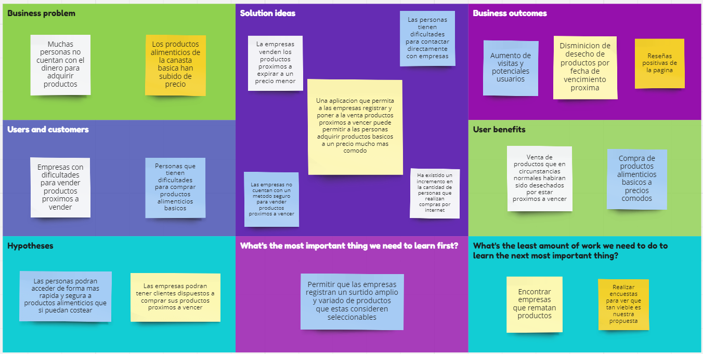
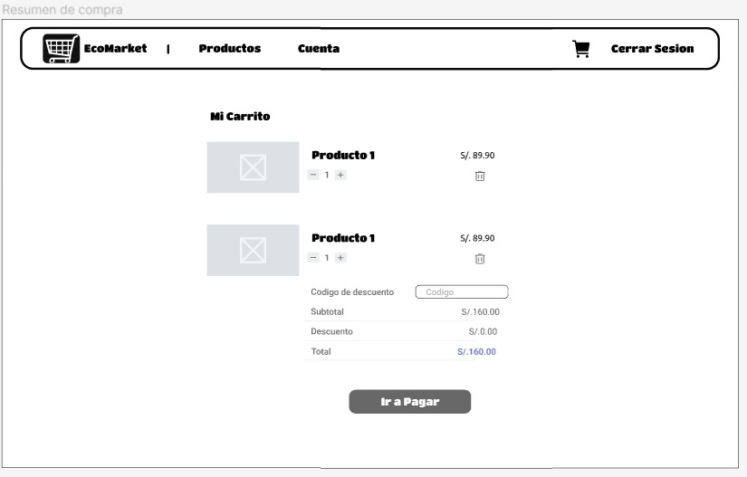
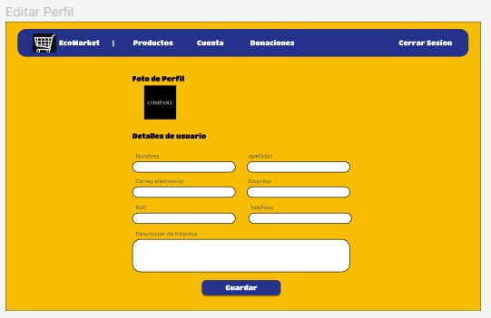
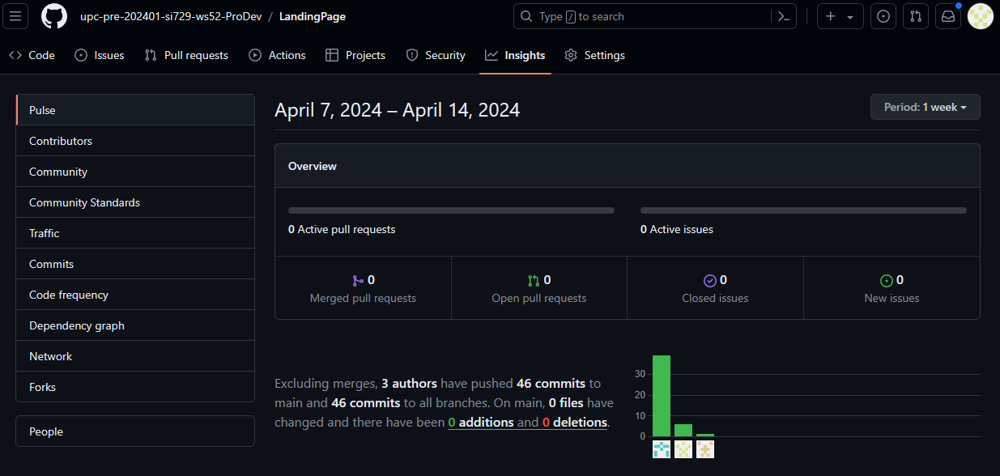

<h1 style="text-align: center;"> Informe del TB1  </h1>
<h2 style="text-align: center;"> Universidad Peruana de Ciencias Aplicadas </h2>

  

<h4 style="text-align: center;"> Ingeniería de Software </h4>
<h4 style="text-align: center;">Desarrollo de Aplicaciones Open Source</h4>
<h4 style="text-align: center;"> Ciclo 2024-01 </h4>
<h4 style="text-align: center;"> WS52</h4>
<h4 style="text-align: center;"> Docente: Elio Jefferson Navarrete Vilca </h4>
<h4 style="text-align: center;"> Startup:  ProDev</h4>
<h4 style="text-align: center;"> Producto: EcoMarket</h4>
<h4 style="text-align: center;"> Grupo de Trabajo: Grupo 1</h4>

## Team Members
|              Nombre               | Código de alumno |
|:---------------------------------:|:----------------:|
|  Quispe Condori, Fernando Daniel  |    U20221C628    |
|  Cortes Hidalgo, Nicolas Andres   |    U202016311    |
| Salazar Saldarriaga, Frank Junior |    U20181H103    |
|Macedo Calsina, Anderson Walter    |    U20201C179    |

## Registro de versiones del informe
|   Fecha    | Versión |      Autor      |                   Descripción de modificación                    |
|:----------:|:-------:|:---------------:|:----------------------------------------------------------------:|
| 01/04/2024 |   1.0   | Quispe Fernando |      Creación de nuestro repositorio e inicio en capítulo 1      |
| 08/04/2024 |   1.1   |  Salazar Frank  |               Actualización del informe capitulo 1               |
| 09/04/2024 |   1.2   | Cortes Nicolas  |  Elaboración de user stories, product backlog e impact mapping   |
| 12/04/2024 |   1.3   | Cortes Nicolas  |   Elaboración de los diagramas c4, mejora de los user stories    |
| 12/04/2024 |   1.4   | Quispe Fernando | Incorporación diagrama de clases y modelado Diseño Base de datos |
| 12/04/2024 |   1.4   |      Todos      |                   Revisión final - Entrega TB1                   |
| 1/05/2024  |   1.5   |      Todos      |                   Correcciones respecto a TB1                    |
| 3/05/2024  |   2.0   |      Todos      |                        Revisión Final TP                         |

## Project Report Collaboration Insights

URL de la organización en Github del proyecto: https://github.com/upc-pre-202401-si729-ws52-ProDev 

**TB1**

|            Integrante             |                                                                                    Tareas Asignadas                                                                                     |
|:---------------------------------:|:---------------------------------------------------------------------------------------------------------------------------------------------------------------------------------------:|
|  Quispe Condori, Fernando Daniel  |                    Elaboración Preguntas de Entrevitas - Artefactos Capítulo 2  , Elaboración Diagrama de clases, Diagrama de base de datos. Colaboración en general                    |
|  Cortes Hidalgo, Nicolas Andres   | Elaboracion de los Emphaty maps, As-Is y To-Be Scenario Mapping, Ubiquitous Langiage, User Stories, Impact Mapping, Product Backlog y diagramas de contexto, contenedores y componentes |
| Salazar Saldarriaga, Frank Junior |                                                      Startup Profile, Solution Profile, Lean UX, Segmentos Objetivos, Landing Page                                                      |
|Macedo Calsina, Anderson Walter    |                                                                 Web Application Design, Prototyping Design, Entrevistas                                                                 |

**TP**

|            Integrante             |                                             Tareas Asignadas                                              |
|:---------------------------------:|:---------------------------------------------------------------------------------------------------------:|
|  Quispe Condori, Fernando Daniel  | Elaboración de componentes referentes a tareas asignadas en el sprint backlog 2. Despliegue del proyecto. |
|  Cortes Hidalgo, Nicolas Andres   |         Mejoras respecto al feedback TB1. Elaboración componentes referente al sprint backlog 2.          |
| Salazar Saldarriaga, Frank Junior |             Elaboración de componentes respecto al spring backlog 2. Despliegue del proyecto.             |
|  Macedo Calsina, Anderson Walter  |                         Elaboración de componentes respecto al sprint backlog 2.                          |

***TB1 Github***: https://github.com/upc-pre-202401-si729-ws52-ProDev/FinalProject 

***TP Github - Fronted Web Application***: https://github.com/upc-pre-202401-si729-ws52-ProDev/fronted-web-application-ProDev 

***Despliegue fronted EcoMarket***: https://fronted-ecomarket.web.app

## Contenido
1. [**Capítulo I: Introducción.**](#1.)  
   1.1. [***Startup Profile***](#1.1.)  
   1.1.1. [Descripción del startup](#1.1.1.) 
   1.1.2.[Perfiles de los integrantes del equipo](#1.1.2.) 
   1.2. [***Solution Profile***](#1.2.) 
   1.2.1. [Antecedentes y Problemática](#1.2.1.) 
   1.2.2. [Lean UX Process](#1.2.2.) 
   1.2.3. [Lean UX Problem Statements](#1.2.3.) 
   1.2.4. [Lean UX Assumptions](#1.2.4.) 
   1.2.5. [Lean UX Hypothesis Statements](#1.2.5.) 
   1.2.6. [Lean UX Canvas](#1.2.5.) 
   1.3. [***Segmentos objetivo***](#1.2.6.) 
2. [**Capítulo II: Requirements Elicitation & Analysis**](#2.) 
   2.1. [***Competidores***](#2.1.) 
   2.1.1. [Análisis competitivo](#2.1.1.) 
   2.1.2. [Estrategias y tácticas frente a competidores](#2.1.2.) 
   2.2. [***Entrevistas***](#2.2.) 
   2.2.1. [Diseño de entrevistas](#2.2.1.) 
   2.2.2. [Registro de entrevistas](#2.2.2.) 
   2.2.3. [Análisis de entrevistas](#2.2.3.) 
   2.3. [***Needfinding***](#2.3.) 
   2.3.1. [User Personas](#2.3.1.) 
   2.3.2. [User Task Matrix](#2.3.2.) 
   2.3.3. [User Journey Mapping](#2.3.3.) 
   2.3.4. [Empathy Mapping](#2.3.4.) 
   2.3.5. [As-is Scenario Mapping](#2.3.5.) 
   2.4. [***Ubiquitous Language***](#2.4.) 
3. [**Capítulo III: Requirements Specification**](#3.) 
   3.1. [***To-Be Scenario Mapping***](#3.1.) 
   3.2. [***User Stories***](#3.2.) 
   3.3. [***Impact Mapping***](#3.3.) 
   3.4. [***Product Backlog***](#3.4.) 
4. [**Capítulo IV: Product Design.**](#4.) 
   4.1. [***Style Guidelines***](#4.1.) 
   4.1.1. [General Style Guidelines](#4.1.1.) 
   4.1.2. [Web Style Guidelines](#4.1.2.) 
   4.2. [***Information Architecture***](#4.2.) 
   4.2.1. [Organization Systems](#4.2.1.) 
   4.2.2. [Labeling Systems](#4.2.2.) 
   4.2.3. [SEO Tags and Meta Tags](#4.2.3.) 
   4.2.4. [Searching Systems](#4.2.4.) 
   4.2.5. [Navigation Systems](#4.2.5.) 
   4.3. [***Landing Page UI Design***](#4.3.) 
   4.3.1. [Landing Page Wireframe](#4.3.1.) 
   4.3.2. [Landing Page Mock-up](#4.3.2.) 
   4.4. [***Web Applications UX/UI Design***](#4.4.) 
   4.4.1. [Web Applications Wireframes](#4.4.1.) 
   4.4.2. [Web Applications Wireflow Diagrams](#4.4.2.) 
   4.4.3. [Web Applications Mock-ups](#4.4.3.) 
   4.4.4. [Web Applications User Flow Diagrams](#4.4.4.) 
   4.5. [***Web Applications Prototyping***](#4.5.) 
   4.6. [***Domain-Driven Software Architecture***](#4.6.) 
   4.6.1. [Software Architecture Context Diagram](#4.6.1.) 
   4.6.2. [Software Architecture Container Diagrams](#4.6.2.) 
   4.6.3. [Software Architecture Components Diagrams](#4.6.3.) 
   4.7. [***Software Object-Oriented Design***](#4.7.) 
   4.7.1. [Class Diagrams](#4.7.1.) 
   4.7.2. [Class Dictionary](#4.7.2.) 
   4.8. [***Database Design***](#4.8.) 
   4.8.1. [Database Diagram](#4.8.1.) 
5. [**Capítulo V: Product Implementation, Validation & Deployment**](#5.) 
   [**Conclusiones**](#Conclusiones) 
    - [**Conclusiones y recomendaciones**](#ConclusionesYrecomendaciones)

   [**Bibliografía**](#Bibliografia) 
   [**Anexos**](#Anexos) 

   

## Student Outcome
El curso contribuye al cumplimiento del Student Outcome ABET:
<b>ABET – EAC - Student Outcome 3</b>

**Criterio:** Capacidad de comunicarse efectivamente con un rango de audiencias.
En el siguiente cuadro se describe las acciones realizadas y enunciados de
conclusiones por parte del grupo, que permiten sustentar el haber alcanzado el logro
del ABET – EAC - Student Outcome 3

| Criterio especifico                                                                                                                                                                   | Acciones realizadas                                                                                                                                                                                                                                                                                                                                                                                                                                                                                                                                                                                                                                                                                                                                                                                                                                                                                                                                                                                                                                                                                                                                                                                                                                                                                                                                                                                                                                                                                                                                                                                                                                                                                                                                                                                                                                                                                                                                                                                                                                                                          | Conclusiones                                                                                                                                                                                                                                                                                                                                                                                                                                                                                                                                                                                                                                                                  |
|---------------------------------------------------------------------------------------------------------------------------------------------------------------------------------------|:---------------------------------------------------------------------------------------------------------------------------------------------------------------------------------------------------------------------------------------------------------------------------------------------------------------------------------------------------------------------------------------------------------------------------------------------------------------------------------------------------------------------------------------------------------------------------------------------------------------------------------------------------------------------------------------------------------------------------------------------------------------------------------------------------------------------------------------------------------------------------------------------------------------------------------------------------------------------------------------------------------------------------------------------------------------------------------------------------------------------------------------------------------------------------------------------------------------------------------------------------------------------------------------------------------------------------------------------------------------------------------------------------------------------------------------------------------------------------------------------------------------------------------------------------------------------------------------------------------------------------------------------------------------------------------------------------------------------------------------------------------------------------------------------------------------------------------------------------------------------------------------------------------------------------------------------------------------------------------------------------------------------------------------------------------------------------------------------|-------------------------------------------------------------------------------------------------------------------------------------------------------------------------------------------------------------------------------------------------------------------------------------------------------------------------------------------------------------------------------------------------------------------------------------------------------------------------------------------------------------------------------------------------------------------------------------------------------------------------------------------------------------------------------|
| Comunica oralmente sus ideas y/o resultados con objetividad a público de diferentes especialidades y niveles jerarquicos, en el marco del desarrollo de un proyecto en ingeniería.    | <b>Quispe Condori, Fernando Daniel</b>  TB1: Desarrollo del vídeo de exposición comunicando las ideas de nuestros artefactos.   TP: Durante el Sprint 2, participé activamente en reuniones de planificación y revisión donde comuniqué oralmente nuestras ideas, incluyendo miembros del equipo con diversos niveles de experiencia técnica. Utilicé un lenguaje claro y objetivo para garantizar que todos comprendieran nuestro enfoque y los desafíos que enfrentábamos.   <b>Cortes Hidalgo, Nicolas Andres</b>  TB1: Desarrollo del video de exposicion comunicando la mayor parte de los apartados tecnicos y de enfoque de usuarios y clientes de la aplicacion   TP: Contribuí a la comunicación oral al facilitar la interacción efectiva entre los miembros del equipo durante el Sprint 2. Fomenté un ambiente de colaboración abierta donde todos tuvieran la oportunidad de expresar sus ideas y preocupaciones, lo que permitió una comunicación clara y fluida en todas las etapas del desarrollo. <b>Salazar Frank</b>  TB1:  Me encargue de la elaboración de Wireframes y contribución de landing page permitiendome cumplir con el outcome.   TP: Durante el Sprint 2, me aseguré de comunicar oralmente nuestras ideas y resultados de manera efectiva a diferentes audiencias dentro del equipo. Participé en discusiones y presentaciones donde expliqué con claridad las decisiones y acciones tomadas durante el desarrollo de la aplicación ProDev, asegurando que todos estuvieran al tanto del progreso y los desafíos.  <b>Anderson Maceda</b>  TB1: Realize entrevistas a los segmentos objetivo que me permitieron adentrarme en tema y concocer a nuestro publico objetivo.   TP: Contribuí a la comunicación oral al presentar de manera efectiva los avances y resultados del desarrollo. Durante las reuniones de revisión del sprint, expliqué con claridad las funcionalidades implementadas y las pruebas realizadas, facilitando la comprensión de nuestro progreso por parte de todos los involucrados.  | **TB1:** En esta entrega pudimos concluir que el desarrollar nuestros artefactos para el análisis de los requisitos de nuestra idea de software, no solo basta con tenerlo en un informe. Tenemos que comunicarlo y explicarlo para que una audiencia general pueda entender claramente.   **TP:** Durante la entrega del presente trabajo, cada miembro del equipo comunico oralmente ideas complejas y resultados técnicos a diversas audiencias. Desde reuniones de planificación hasta presentaciones de revisión de sprint, la comunicación oral fue clara, concisa y efectiva, lo que facilitó una comprensión compartida del progreso y los desafíos del proyecto. |
| Comunica en forma escrita ideas y/o resultados con objetividad a público de diferentes especialidades y niveles jerarquicos, en el marco del desarrollo de un proyecto en ingeniería. | <b>Quispe Condori, Fernando Daniel</b>  TB1: Desarrollo artefactos Needfinding y Diagramas de clases y datos.   TP: Durante el Sprint 2, me enfoqué en la comunicación escrita al elaborar documentación detallada sobre los procesos y decisiones clave del equipo. Escribí informes y documentos técnicos con un enfoque objetivo, asegurándome de que la información fuera clara y accesible para todos los interesados en el desarrollo de la aplicación ProDev.   <b>Cortes Hidalgo, Nicolas Andres</b>  TB1: Me encargue del desarrollo de los diagramas de componentes, contexto y contenedores, asi como las user stories y el product backlog.    TP: Contribuí a la comunicación escrita al documentar las actividades y resultados del equipo durante el Sprint 2. Escribí informes de progreso y documentación técnica con un lenguaje claro y objetivo, lo que permitió a otros miembros del equipo entender fácilmente nuestras acciones y seguir nuestro progreso en el desarrollo de la aplicación.  <b>Salazar Frank</b>  TB1: También realize actividades de Needfindng.           TP:  Durante el Sprint 2, me encargué de comunicar por escrito nuestras ideas y resultados a través de informes y documentación técnica detallada. Escribí con claridad y precisión, asegurándome de que la información fuera comprensible para audiencias con diferentes niveles de experiencia técnica, incluyendo desarrolladores, gerentes y otros interesados en el proyecto.  <b>Anderson Maceda</b>  TB1: Realize Wireframes, mockups y user flows que me permitieron cumplir con los diseños    TP: Contribuí a la comunicación escrita al elaborar documentación exhaustiva sobre los servicios y procesos implementados en nuestra aplicación ProDev durante el Sprint 2. Escribí con un enfoque objetivo y claro, asegurándome de que la información fuera fácilmente comprensible y accesible para todos los involucrados en el proyecto.                                                                                           | **TB1:** Tenemos cómo conclusión que nuestros artefactos de obtenciónde requisitos tienen que también enfocarse al público en general, ya sea con distintas especialidades por ejemplo. Para una correcta comunicación entre todos y llevar el proyecto de forma satisfactoria.  **TP**: Durante el presente trabajo, nuestro equipo destacó por su habilidad para comunicar ideas y resultados de manera escrita de forma clara y objetiva. Desde la elaboración de informes de progreso hasta la documentación técnica detallada, proporcionamos una base sólida para el entendimiento y seguimiento del proyecto para llevar a cabo la realizacion del mismo.          |

<h2>Capítulo I: Introducción</h2>

<h3> 1.1 Startup Profile</h3>

"Pro Dev" es una startup tecnológica dedicada a combatir el desperdicio de alimentos en Perú mediante el desarrollo de soluciones innovadoras que conectan a productores, procesadores, y consumidores finales. Nuestra plataforma utiliza tecnología avanzada para facilitar la distribución eficiente de alimentos que están cerca de su fecha de vencimiento, asegurando que estos lleguen a consumidores a precios reducidos y en condiciones óptimas, reduciendo así el impacto ambiental y económico del desperdicio alimentario.

<h4> 1.1.1. Descripción del startup</h4>

ProDev, es una startup la cual se enfoca en vender productos de calidad a precios altamente accesibles. Nuestra empresa nace debido a la gran preocupación por el desperdicio de alimentos a nivel nacional. Hemos buscado abordar dicho problema desarrollando una aplicación la cual permite a nuestros clientes la compra de productos de supermercados o negocios a precios altamente accesibles, esto tomando en cuenta que los productos están cerca a su fecha de vencimiento y de tal manera evitando el desperdicio de estos alimentos. El desarrollo de nuestra aplicación contará con una atractiva e intuitiva interfaz, como a la vez contará con un catálogo variado de centros comerciales y empresas, asegurándonos de que el cliente cuente con la mayor diversidad de productos posible.

**Misión:**
Nuestra misión es proporcionar un servicio excepcional a nuestros clientes, garantizando al mismo tiempo que mantenemos la más alta calidad en cada uno de nuestros productos. Nos esforzamos por ofrecer soluciones sostenibles y eficientes que no solo satisfagan las necesidades de nuestros clientes, sino que también contribuyan a la reducción del desperdicio de alimentos, promoviendo un impacto positivo tanto en la sociedad como en el medio ambiente.

**Visión:**
Aspiramos a ser líderes a nivel nacional en la venta y distribución de productos alimenticios, destacándonos por la accesibilidad y la alta calidad de nuestros productos. Nos proponemos alcanzar más de 10,000 ventas al mes, implementando prácticas innovadoras y sostenibles que nos diferencien en el mercado y nos permitan expandir nuestro alcance a todos los rincones del país.

##### Logotipo de la Startup: 

##### Logotipo del producto

<h4> 1.1.2. Perfiles de los integrantes del equipo</h4>

|                                                                                                                                                                                                                                      Descripción de los perfiles de los integrantes del equipo                                                                                                                                                                                                                                       |                            Foto del integrante                             |
|:------------------------------------------------------------------------------------------------------------------------------------------------------------------------------------------------------------------------------------------------------------------------------------------------------------------------------------------------------------------------------------------------------------------------------------------------------------------------------------------------------------------------------------:|:--------------------------------------------------------------------------:|
|                                                                    Mi nombre es Fernando Quispe, soy una persona proactiva que puede aportar y liderar la colaboración en equipo con el objetivo de un logro común. Me gusta el desarrollo de software y poder contribuir a la sociedad con lo que me apasiona. Tengo como meta adquirir los conocimientos de una manera clara para poder aplicarlos en los distintos proyectos tal cuál como el proyecto actual.                                                                    |                                                                              |
| Mi nombre es Nicolas Cortes, tengo 21 años y estudio la carrera de Ingenieria de Software en la Universidad Peruana de Ciencias Aplicadas. Soy una persona responsable y proactiva que siempre busca ayudar en todo lo posible a su grupo para lograr terminar cualquier tipo de trabajo o actividad de la forma mas rapida y presentable posible. Mi meta al terminar este curso es lograr entender todos los conceptos nuevos que sean necesarios para posteriormente aplicarlos mas adelante en mi carrera y en el mundo laboral. |  
|                                                                 Mi nombre es Frank Junior Salazar Saldarriaga, tengo 23 años y estudio la carrera de Ingeniería de Software en la UPC. Soy una persona autodidacta, proactiva y desarrolladora del trabajo en equipo, a la cual le gusta el hecho de poder crear cosas nuevas que tengan un impacto en las personas. Mi meta al terminar el curso es dominar cada uno de los lenguajes que se ven durante el curso.                                                                  | 
| Mi nombre es Anderson Walter Macedo Calsina, tengo 22 años y soy estudiante de la carrera de ing de software en la UPC. Me gusta ayudar a los demás y colaborar para un trabajo en conjunto. Estoy dispuesto a esforzarme y estar comprometido en mis cursos y actividades designadas, orientando las soluciones a las diversas propuestas.                                |                                       |                                                                                                                                                                 

<h3> 1.2. Solution Profile</h3>

EcoMarket ofrece una óptima solución con el objetivo de lograr reducir el desperdicio de alimentos y permitir el ingreso adicional a aquellas empresas que ya contaban con los egresos que generarían el desperdicio de sus productos. Nuestros clientes podrán acumular puntos por cada compra exitosa realizada, los cuales les permitirán obtener descuentos en futuras ventas. Las empresas tendrán opciones como la publicación de sus productos y un registro de ventas para cada uno de ellos. EcoMarket obtendrá ganancias a través de una comisión por cada venta exitosa realizada. Por estos motivos se propone a EcoMarket como solución para reducir el desperdicio innecesario de alimentos y con ello realizar un negocio sostenible mediante la venta de estos.

<h4> 1.2.1. Antecedentes y Problemática</h4>

### 5W
##### What (Qué)
La falta de acceso a productos vitales por parte de las familias peruanas en estado de pobreza es un problema persistente que afecta a muchas comunidades en el país. Además, existe una preocupación generalizada por reducir el desperdicio de alimentos tanto por parte de empresas como de los vendedores minoristas.

##### When (Cuando)
Este problema ha estado en curso durante muchos años en Perú. Se remonta a décadas atrás debido al desconocimiento de soluciones efectivas para lograr la venta de productos con fechas de vencimiento próximas.

#### Where (Dónde)
¿Dónde surge el problema?
El problema se origina en diversas áreas, principalmente en empresas y bodegas que se dedican al rubro de ventas de productos alimenticios en todo el país.

##### Who (Quién)
Familias peruanas que se encuentran en la pobreza y pobreza extrema son las más afectadas por la falta de acceso a productos vitales. Por otro lado, en el ámbito empresarial, aquellas empresas que no encuentran soluciones para evitar la pérdida generada por el desperdicio de estos productos enfrentan desafíos significativos.

##### Why (Por qué)
La creciente falta de accesibilidad a productos esenciales debido a los precios excesivos está provocando un aumento en la desigualdad económica en Perú. En el caso de las empresas, el desconocimiento de soluciones para evitar las pérdidas económicas debido al desperdicio de alimentos es un factor clave.

### 2H
#### How (Cómo)
##### ¿Cómo se utilizará el producto?
El producto se utilizará como una herramienta para abordar el problema en el momento en que las bodegas o supermercados no logran vender sus productos antes de que estos alcancen su fecha de vencimiento.

#### How much (Cuánto)
##### ¿Cuál es la magnitud del problema?
La magnitud del problema es considerable, con comerciantes sufriendo grandes pérdidas al no poder vender sus productos antes de que caduquen. Según SaleCycle, el fenómeno de esperar rebajas para realizar compras se intensifica, con un 63,5% de consumidores esperando ofertas para adquirir productos cercanos a su vencimiento. Esto resalta la necesidad urgente de implementar soluciones que beneficien tanto a consumidores como a comerciantes.

Este escenario subraya la importancia de desarrollar e implementar políticas y estrategias enfocadas tanto en la accesibilidad a alimentos para las familias en situación de vulnerabilidad como en la optimización de procesos por parte de las empresas para minimizar el desperdicio de alimentos, generando un impacto positivo tanto social como económico.

<h4> 1.2.2. Lean UX Process</h4>

<h5> 1.2.2.1. Lean UX Problem Statements</h5>

##### **Problem Statement:**

###### **Ciudadanos peruanos**
El alto costo de los alimentos coloca a muchas personas de bajos ingresos en una situación difícil porque no pueden afrontar los precios actuales. Aunque algunas empresas venden productos cercanos a su fecha de vencimiento con descuentos, no todos los residentes tienen acceso a estas ofertas.

¿Cómo podemos reducir el desperdicio de alimentos ayudando a las personas de bajos ingresos a obtener alimentos a precios más bajos y garantizando al mismo tiempo la seguridad alimentaria?

###### **Empresas peruanas**
El alto costo de los alimentos ha reducido las ventas de algunas empresas, ya que los consumidores prefieren opciones más baratas. Además, muchos de estos productos se almacenan hasta que caducan y finalmente se desechan, lo que cuesta dinero a las empresas.

¿Cómo ayudamos a las empresas a reducir el desperdicio de alimentos y aumentar las ganancias para que puedan vender estos productos a precios más bajos y hacerlos accesibles a los consumidores?

<h5> 1.2.2.2. Lean UX Assumptions</h5>

##### **Business Assumptions:**
1. *Creo que mis clientes tienen la necesidad de adquirir productos alimenticios de calidad a precios accesibles.*
2. *Estas necesidades se pueden resolver con una aplicación en donde encuentres estos productos a un precio más accesible de lo cotidiano.*
3. *Mis clientes iniciales serán personas que no cuentan con el dinero para la compra de productos alimenticios.*
4. *El valor número 1 que un cliente quiere obtener de mi producto es adquirir una variedad de productos alimenticios a buen precio.*
5. *Obtendré la mayoría de mis clientes a través de recomendaciones y publicidad en redes sociales.*
6. *Voy a ganar dinero por comisiones en cada venta.*
7. *Mi principal competencia en el mercado serán las grandes empresas con sus propios descuentos.*
8. *Los venceremos debido a nuestra variedad de productos y amplio catálogo de supermercados.*
9. *Mi mayor riesgo es la poca variedad o la limitada cantidad de productos.*
10. *Resolveremos esto a través de Recomendar el mismo producto pero de una marca diferente a la que nuestros usuarios quieren comprar.*
11. *Sabremos que tenemos éxito cuando veamos los siguientes cambios en el comportamiento del cliente: Han aumentado las compras de diversos productos que ofrecemos.*

##### **User Assumptions:**
###### **¿Quién es el usuario?** 
Personas que no cuentan con los suficientes recursos.

###### **¿Qué problemas resuelve nuestro producto?**
Resuelve el problema de la mala alimentación de las personas por no tener los recursos suficientes para acceder a los productos alimenticios. También resuelve el problema de la pérdida de dinero de las empresas por el desperdicio de estos productos.

###### **¿Qué características son importantes?**
Poder adquirir el producto que necesitemos desde cualquier punto a precios totalmente accesibles.

###### **¿Dónde encaja nuestro producto en su trabajo o vida?** 
En su día a día

###### **¿Cuándo y cómo es nuestro producto usado?**
Siempre que necesiten productos alimenticios a precios totalmente accesibles, tan solo ingresando a la aplicación.

###### **¿Cómo debe verse nuestro producto y cómo debe comportarse?**
Intuitivo, funcional y eficaz, donde el usuario de forma rápida y sencilla realice sus pedidos y sin mayor complicación también el pago.

<h5> 1.2.2.3. Lean UX Hypothesis Statements.</h5>

* **Hypothesis Statement 01:**

###### Usuario Cliente
  **Creemos que**, al desarrollar una aplicación en dónde se pueda encontrar productos alimenticios a precios considerablemente más accesibles

  **Lograremos**, apoyar a aquellos ciudadanos que no cuentan con los recursos suficientes para acceder a estos productos

  **Sabremos que hemos tenido éxito**, cuando la cantidad de productos vendidos de forma exitosa se haya incrementado en un 40% con respecto a los tres primeros meses de lanzada la aplicación.

###### Usuario Empresa
**Creemos que**, al comprar los productos que están próximos  a su fecha de caducidad o tuvieron defectos en el empaquetado.

**Lograremos**, evitar desechar estos alimentos y a la vez evitaremos las grandes pérdidas que esto provocaba para las empresas.

**Sabremos que hemos tenido éxito**, cuando la totalidad de los productos adquiridos hayan sido vendidos de manera exitosa.

<h5> 1.2.2.4. Lean UX Canvas</h5>

#### ***Lean UX Canvas:***

Se presenta el artefacto realizado Lean UX Canvas. La cuál nos ayuda a tener una visión general de nuestro producto y cómo se llevará a cabo.

<h3> 1.3. Segmento objetivo</h3>

En esta sección, se presentan los segmentos objetivo de nuestro producto EcoMarket.

- **SEGMENTO CLIENTES:** Personas que adquieren productos a través de nuestra plataforma. Nos enfocamos en estas personas ya son ellas las que adquirirán los productos de las empresas a bajo costo mediante nuestra solución. **_Ellos tienen la necesidad de comprar productos a bajo coste._**
- **SEGMENTO EMPRESAS:** Personas que venden productos a través de nuestra plataforma. Nos enfocamos en estas personas ya que son ellas las que ofrecerán sus productos a través de nuestra plataforma al tener productos defectuosos y/o próximos a vencer. **_Ellos tienen la necesidad de vender productos que están próximos a vencer para evitar pérdidas._**

[//]: #CAPITULO2

<h2> Capítulo II: Requirements Elicitation & Analysis</h2>

<h3> 2.1. Competidores</h3>
Tras nuestra idea de solución, nos podemos enfrentar a soluciones ya existentes en el mercado con el mismo propósito y/o algunas características similares. Por ello, es importante conocer a nuestros competidores y analizar sus estrategias y tácticas.

Teniendo cómo principales competidores a:

- Sugo
- Save Up
- Good After

<h4> 2.1.1. Análisis competitivo</h4>

En esta sección detallaremos en el siguiente cuadro a continuación detalles entre nuestros 3 competidores.

Imagen: Cuadro de Analisis entre competidores principales.

  
<h4> 2.1.2. Estrategias y tácticas frente a competidores</h4>

Teniendo en cuenta el análisis anterior de nuestros competidores podemos definir las siguientes estrategias para poder sobresalir sobre ellos.

- <b>Identificar las debilidades de la competencia y ser los mejores:</b> Esta estretegia será muy útil para marcar sobre todo nuestro valor agregado, 
cómo es el caso de mejores descuentos y/o alianzas con distintas compañias. Incrementando por ejemplo la relación con donaciones.
- <b>Publicidad y Marketing:</b> Incrementaremos en nuestra fase inicial esta característica para poder llegar a más personas y así poder tener un mayor alcance. Alianzas con otras compañías
y promociones diferenciadas para cada sector de nuestro público objetivo.
- <b>Mejor análisis de mercado:</b>Nuestros competidores se han enfocado en un solo sector de la población, nosotros nos enfocaremos en la diversidad de la población, ofreciendo diversos productos
ya que contaremos con muchas alianzas que nos ayudarán a tener un mayor alcance.
- <b>Diversidad en nuestras plataformas: </b> Estaremos activos en distintas redes sociales y nuestra plataforma web será excelente ya que brindará características
que los usuarios necesitan y un funcionamiento providencial.

  
<h3> 2.2. Entrevistas</h3>

  
<h4> 2.2.1. Diseño de entrevistas</h4>

  
En esta sección se procederá a detallar las preguntas para el método de recoleccion de
  requisitos que son las entrevistas. Para la formulación se siguieron buenas prácicas tales como 
  formulación de preguntas abiertas, así mismo obtenemos características demográficas con las entrevistas
  

  A continuacion se presentan las preguntas para el sector de Clientes

1. ¿Nos podrías brindar por favor tu nombre, edad, ocupación, nivel de educación y nivel aproximado de ingresos?
2. ¿Dónde resides actualmente?
3. ¿Cuál es tu principal motivo para comprar productos en línea?
4. ¿Qué tipo de productos sueles comprar en línea?
5. ¿Has sido afectado por la crisis económica, perdiendo tu capacidad de adquisición?
6. ¿Qué tan importante es para ti la calidad de los productos que compras?
7. ¿Buscas productos de calidad o buscas productos a precios bajos?
8. ¿Crees que una plataforma web de compra de productos a punto de vencer y/o defectos te serían útil?
9. ¿Qué tan importante es para ti la fecha de vencimiento de los productos que compras?

A continuacion se presentan las preguntas para el sector de Empresas

1. ¿Nos podrías brindar por favor tu nombre, edad, ocupación, nivel de ducación y su empresa y/o tienda?
2. ¿Dónde resides actualmente?
3. ¿Cuál es tu principal motivo para vender productos?
4. ¿Qué tipo de productos sueles vender en línea y presencialmente?
5. ¿Has sido afectado por la crisis económica, perdiendo ventas?
6. ¿Que quejas obtiene con frecuencia de sus cliente?
7. ¿Alguna vez compró un producto y la venta no fue la esperada?
8. Si es así, ¿Qué hizo con el producto?
9. ¿Que le parece la idea de vender productos a punto de vencer y/o defectos a un precio más bajo a través de nuestra plataforma? 
10. En algunos casos, ¿Le llamaría la atención la contribución de ciertos para donaciones?

  
<h4> 2.2.2. Registro de entrevistas</h4>

***Entrevistas a empresas***

| Nombre entrevistado                     | Stephanie Ccama                                                                                                                                                                                                                                                                                                             |
|-----------------------------------------|-----------------------------------------------------------------------------------------------------------------------------------------------------------------------------------------------------------------------------------------------------------------------------------------------------------------------------|
| Edad                                    | 19 años                                                                                                                                                                                                                                                                                                                     |
| Departamento                            | Lima                                                                                                                                                                                                                                                                                                                        |
|  | En esta entrevista, Stephanie nos detalla acerca de su empresa familiar, la cuál es administra por ella producto de un retiro temprano por parte de su padre. Stephanie menciona que se encuentra con frecuencia con productos defectuosos o con fechas de vencimiento proximas, este tipo de productos son declarados por su empresa como merma y son desechados, perdiendo todo valor que pudiesen tener. Sin embargo, ella menciona que estarían dispuesta a usar nuestra aplicación y también a realizar muchas donaciones.                             |
| Duración entrevista: 03:37 min          | [URL](https://upcedupe-my.sharepoint.com/:v:/g/personal/u20221c628_upc_edu_pe/Ea8IgRWiDqlJuIEa1LVY5OABIZSASae-pZPRl-coy46yVw?nav=eyJyZWZlcnJhbEluZm8iOnsicmVmZXJyYWxBcHAiOiJTdHJlYW1XZWJBcHAiLCJyZWZlcnJhbFZpZXciOiJTaGFyZURpYWxvZy1MaW5rIiwicmVmZXJyYWxBcHBQbGF0Zm9ybSI6IldlYiIsInJlZmVycmFsTW9kZSI6InZpZXcifX0%3D&e=CUrpvW) |

| Nombre entrevistado                          | Kevin Palomino                                                                                                                                                                                                                                                             |
|----------------------------------------------|----------------------------------------------------------------------------------------------------------------------------------------------------------------------------------------------------------------------------------------------------------------------------|
| Edad                                         | 22 años                                                                                                                                                                                                                                                                    |
| Departamento                                 | Lima                                                                                                                                                                                                                                                                       |
|  | En esta entrevista, Kevin nos detalla acerca de su empresa propia, en la que se realizan ventas de productos a través de las Redes Sociales. Despues de la pandemia, afrontaron muchas crisis y vieron reducidas en un numero considerable sus ganacias producto de la perdida de clientes. No obstante, están dispuestos a vender productos siempre y cuando la fecha de vencimiento esté correcta ya que jamás venderían productos que estén vencidos. |
| Duración entrevista: 04:51 min               | [URL](https://upcedupe-my.sharepoint.com/:v:/g/personal/u20181h103_upc_edu_pe/EbWjDXKAVNRJnxzqalZsIUABFUWpzneNUpV3hm5E49Cm2w?e=B1DrWc)                                                                                                                                     |

| Nombre entrevistado                          | Esteban Morales                                                                                                                                                                                              |
|----------------------------------------------|------------------------------------------------------------------------------------------------------------------------------------------------------------------------------------------------------------|
| Edad                                         | 25 años                                                                                                                                                                                                    |
| Departamento                                 | Lima                                                                                                                                                                                                       |
|  | En la entrevista, Esteban nos cuenta que es gerente de operaciones en una de las sedes de la cadena de supermercados "Plaza Vea". Esteban cuenta que desechan una gran cantidad de productos debido a que, los productos proximos a vencer y defectuosos son declarados como merma y son, en su mayoria, desechados. Esteban dice que no veria con malos ojos la existencia de una aplicacion que permita a las empresas vender sus productos proximos a vencer a un precio menos. |
| Duración entrevista: 05:34 min               | [URL ](https://drive.google.com/file/d/1iLOrUPxAp5IVJKUenVJAE1f0DgCCLRKz/view?usp=sharing)                                                                                                                             |

| Nombre entrevistado                          | Geyko Llanos                                                                                                                                                                                              |
|----------------------------------------------|------------------------------------------------------------------------------------------------------------------------------------------------------------------------------------------------------------|
| Edad                                         | 25 años                                                                                                                                                                                                    |
| Departamento                                 | Lima                                                                                                                                                                                                       |
|  | En la entrevista, Geyko nos comenta que es el administrador de una empresa familiar dedicada a la venta de productos alimenticios basicos, la cual heredo debido a la decision de padre de retirarse. Gyeko nos comenta que se ha visto forzado a aumentar el precio de sus productos debido a esta ultima recesion. Sin embargo, Geyko ve con buenos ojos la aplicacion propuesta por nosotros, debido a que le permitiria vender productos cotidianos a un precio bajo. |
| Duración entrevista: 02:42 min               | [URL ](https://drive.google.com/file/d/1iLOrUPxAp5IVJKUenVJAE1f0DgCCLRKz/view?usp=sharing)                                                                                                                         |

***Entrevista a clientes***

| Nombre entrevistado                          | Fernando Quispe                                                                                                                                                                                                                                                                                    |
|----------------------------------------------|----------------------------------------------------------------------------------------------------------------------------------------------------------------------------------------------------------------------------------------------------------------------------------------------------|
| Edad                                         | 19 años                                                                                                                                                                                                                                                                                            |
| Departamento                                 | Lima                                                                                                                                                                                                                                                                                               |
|  | En la entrevista, Fernando nos señala que producto de la crisis económica tuvo que reducir su capacidad económica. Fernando se vio visto a reducir sus gastos generales puesto que no puede costearse ciertos productos que antes podia comprar con total normalidad. Esto lo llevo a conocer la compra en línea, dónde puede el comprar productos en oferta. Es por ello que estaría abierto a usar una plataforma web dónde consiga productos económicos. |
| Duración entrevista: 03:54 min               | [URL](https://upcedupe-my.sharepoint.com/:v:/g/personal/u20201c179_upc_edu_pe/EaS6aMjlVkhBl4s1bd6W9f4BxabN0w_QhWxEIBcWG1tL7g)                                                                                                                                                                                                                                                                                                |

| Nombre entrevistado                          | Melisa Luque                                                                                                                                                                                                                                                                                                                  |
|----------------------------------------------|-------------------------------------------------------------------------------------------------------------------------------------------------------------------------------------------------------------------------------------------------------------------------------------------------------------------------------|
| Edad                                         | 20 años                                                                                                                                                                                                                                                                                                                       |
| Departamento                                 | Lima                                                                                                                                                                                                                                                                                                                          |
|  | En esta entrevista Melisa nos cuenta que su familia vive en una zona bastante pobre del pais y que, por lo tanto, desde siempre han contado con dificultades para acceder a los productos de la canasta basica. Melissa cuenta que, tras la crisis economica derivada de la pandemia, esta dificultad para encontrar productos a precios comodos se ha incrementado, y que constantemente buscan la forma de encontrar productos alimenticios a un precio menor. Melissa cuenta ademas que estaría dispuesta a utilizar la plataforma ya que sería de mucha ayuda para ella.                                                                                                                                                                                                    |
| Duración entrevista: 03:37 min               | [URL](https://upcedupe-my.sharepoint.com/:v:/g/personal/u20201c179_upc_edu_pe/Edd5zAkIv3lFhmQbu8elXPYBpazevYwKEvVjTXgB0mzYUg?e=612tlm&nav=eyJyZWZlcnJhbEluZm8iOnsicmVmZXJyYWxBcHAiOiJTdHJlYW1XZWJBcHAiLCJyZWZlcnJhbFZpZXciOiJTaGFyZURpYWxvZy1MaW5rIiwicmVmZXJyYWxBcHBQbGF0Zm9ybSI6IldlYiIsInJlZmVycmFsTW9kZSI6InZpZXcifX0%3D) |

| Nombre entrevistado                          | Andrea García                                                                                                                                                                                              |
|----------------------------------------------|------------------------------------------------------------------------------------------------------------------------------------------------------------------------------------------------------------|
| Edad                                         | 20 años                                                                                                                                                                                                    |
| Departamento                                 | Lima                                                                                                                                                                                                       |
|  | En la entrevista Andrea nos relata lo difícil que ha sido para ella la pandemia, pues un gran numero de empresas se han visto forzadas a incrementar el costo de productos alimenticios basicos. Andrea nos relata que su familia no cuenta con una solvencia economica para poder acceder a los nuevos precios de productos que ambos compraba. Nos indica ademas, que ve con buenos ojos que existan formas para acceder a productos basicos por un precio menor al encontrado en los mercados en general. |
| Duración entrevista: 03:37 min               | [URL ](https://drive.google.com/file/d/1DCItMb8vaBsD3ePaFMu6hRixOpOFS8mz/view)             |

| Nombre entrevistado                          | Jennifer Salvatierra                                                                                                                                                                                             |
|----------------------------------------------|------------------------------------------------------------------------------------------------------------------------------------------------------------------------------------------------------------|
| Edad                                         | 21 años                                                                                                                                                                                                    |
| Departamento                                 | Lima                                                                                                                                                                                                       |
|  | En la entrevista, Jennifer nos relata que actualmente se encuentra en una situacion economica comoda, mas si ha notado que una gran cantidad de productos que solia comprar con normalidad han incrementado sus precios considerablemente. Jennifer nos cuenta tambien que su tipo de compra favorita es la compra en linea, debido a la facilidad para encontrar productos y los descuentos exclusivos que se ofrecen en esta modalidad |
| Duración entrevista: 03:37 min               | [URL ](https://drive.google.com/file/d/1DCItMb8vaBsD3ePaFMu6hRixOpOFS8mz/view)            |

  
<h4> 2.2.3. Análisis de entrevistas</h4>

En esta sección se presentará el análisis de las entrevistas realizadas a los usuarios. Se presentarán las respuestas obtenidas y se realizará un análisis de las mismas.

<h4>Rango de edad de los posibles usuarios</h4>

Segun los entrevistados, estos se encuentran en un rango de edad desde los 21 hasta los 27 años. Tenemos que considerar que estas entrevistas se realizaron a personas jovenes, pues estos estan mas adaptados a las tecnologias de hoy en dia. Sin embargo, no descartamos que usuarios mayores de 30 años se sientan atraido por nuestra aplicacion.

<h4>Preferencias a la hora de comprar productos en linea</h4>

Luego de entrevistar tanto a cleintes como a empresarios, pudimos observar que el tipo de producto mas seleccionado a la hora de realizar compras en linea son las carnes, seguido de los productos electronicos y los lacteos. La categoria de "otros productos" corresponde productos varios comprados por los clientes, agrupando las categorias restantes.

<h4>Que tanto se sintieron afectados los posibles usuarios por la crisis economica?</h4>

Se le pregunto a nuestros entrevistados que tan afectados se sentian por la crisis economica. Se distinguieron 3 categorias, "poco afectado", "bastante afectado" y "muy afectado".

<h4>Importancia de la calidad de un producto</h4>

Segun nuestros entrevistados, logramos identificar que los usuarios sienten que la calidad del producto afecta de 3 posibles manera a la importancia que ellos le dan a la hora de comprarlo.

  
<h4>Importancia de la fecha de vencimiento de un producto</h4>

Segun nuestros entrevistados, la fecha de vencimiento es un factor que puede afectar de 3 posibles maneras la desicion de si comprar o no un producto: no muy importante, bastante importante y muy importante

<h4>Posible rentabilidad de la aplicacion</h4>

Nuestros entrevistados consideran que la rentabilidad de nuestra aplicacion puede ser medida a traves de 3 apartados: no rentable, rentable y muy rentable

  
<h3> 2.3. Needfinding</h3>

  <h4>2.3.1 User Persona</h4>
  A continuación se presentan las User Personas para nuestro producto. En base a nuestros dos segmentos objetivos definidos. Se realizaron los artefactos en la herramienta UXPressia.

   - Segmento Clientes: Personas que adquieren productos a través de nuestra plataforma.
   - Segmento Empresas: Personas que venden productos a través de nuestra plataforma.

   User Persona de Cliente: Click [aquí](https://uxpressia.com/w/ezex3/p/uLv62) para ver la User Persona de Cliente
      

   User Persona de Empresa: Click [aquí](https://uxpressia.com/w/ezex3/p/WoZAm) para ver la User Persona de Empresa
      
  <h4>2.3.2 User Task Matrix</h4>
  A continuación se presenta el User Task Matrix con las tareas de los usuarios y la importancia y frecuencia para cada usuario.

   Se presenta para el segmento de clientes:

| Tareas de los usuarios                | Importancia | Frecuencia |
|---------------------------------------|-------------|------------|
| Buscar los productos que va a comprar | Alta        | Alta       |
| Buscar las mejores ofertas            | Alta        | Alta       |
| Realizar el pago de los productos     | Baja        | Media      |
| Verificar la calidad de los productos | Baja        | Media      |
| Verificar la fecha de vencimiento     | Media       | Media      |
| Verificar la reputación de la empresa | Media        | Media       |

Se presenta para el segmento de empresarios:

| Tareas de los usuarios                             | Importancia | Frecuencia |
|----------------------------------------------------|-------------|------------|
| Publicar los productos que va a vender             | Alta        | Alta       |
| Verificar las ventas realizadas                    | Alta        | Alta       |
| Decidir productos que va a comprar                 | Alta        | Alta       |
| Seleccionar productos que defectuosos              | Media       | Alta       |
| Seleccionar productos que están próximos a caducar | Media       | Alta       |
| Realizar donaciones                                | Baja        | Baja       |

  <h4>2.3.3 User Journey Mapping</h4>
    A continuación se presenta el User Journey Mapping para el segmento de clientes y empresas.

  User Journey Mapping de Cliente: Click [aquí](https://uxpressia.com/w/ezex3/p/1b3e7) para ver el User Journey Mapping de Cliente
      

  User Journey Mapping de Empresa: Click [aquí](https://uxpressia.com/w/ezex3/p/1b3e7) para ver el User Journey Mapping de Empresa
      

  <h4>2.3.4 Empathy Mapping</h3>
    A continuación se presenta el Empathy Mapping para el segmento de clientes y empresas.

<strong>Cliente</strong>

<strong>Vendedor</strong>

<h4>2.3.5 As-Is Scenario Mapping</h3>

Nicolas desea adquirir productos alimenticios para su consumo semanal.

Sofia desea vender sus productos cuya fecha de caducidad está por llegar.

<h3>2.4 Ubiquitious language</h3>

Se presenta el lenguaje ubicuo para nuestro producto EcoMarket.

| Término | Definición |
|---------|------------|
| EcoMarket | Plataforma de venta de productos alimenticios a precios accesibles |
| Cliente | Persona que adquiere productos a través de nuestra plataforma |
| Empresa | Persona que vende productos a través de nuestra plataforma |
| Producto | Alimento que se vende en nuestra plataforma |
| Vendedor | Persona que vende productos a través de nuestra plataforma |
| Comprador | Persona que adquiere productos a través de nuestra plataforma |
| Precio | Costo de un producto |
| Descuento | Reducción del precio de un producto |
| Oferta | Producto con un precio reducido |
|Donación | Entrega de productos a determinada ONG y/o institución |
| Fecha de vencimiento | Fecha en la que un producto caduca |
|Problema | Tipo de problema del producto con defecto y/o fecha de vencimiento |

<h2>Capitulo III: Requirements Specification</h2>
<h3>3.1 To-Be Scenario Mapping</h3>

Nicolas desea adquirir productos alimenticios para su consumo semanal.

Sofia desea vender sus productos cuya fecha de caducidad está por llegar.

<h3>3.2 User Stories</h3>
<table>
  <tr><th>Epic/User Story ID</th> <th>Titulo</th> <th>Descripcion</th></tr>
  <tr><th>EP001</th> <td>Mejora la experiencia del usuario</td> <td>Como usuario de EcoMarket quiero que la aplicación me ofrezca una experiencia intuitiva y agradable. Esto implica un sistema de perfiles funcionales, mejor autenticación, navegación de productos y tiendas sencillas y un sistema de notificaciones efectivas para mantenerme informado con todas las novedades de la plataforma.</td></tr>
  <tr><th>EP002</th> <td>Gestion de compras y productos</td> <td>Como usuario de EcoMarket, quiero administrar mis compras de forma eficiente: Agregar fácilmente productos al carrito, ver un resumen claro de mi compra y confirmar sin dificultad. Además, deseo revisar mi historial de compras para llevar un registro adecuado.</td></tr>
  <tr><th>EP003</th> <td>Gestion de metodos de pago</td> <td>Como usuario de EcoMarket, deseo gestionar los métodos de pago que utilice de forma segura, rápida y eficiente. Quiero agregar, modificar y eliminar métodos de pago para realizar transacciones de manera rápida.</td></tr>
  <tr><th>EP004</th> <td>Gestion de productos para vendedores</td> <td>Como vendedor de EcoMarket, deseo exhibir los productos que tenga para ofrecer en la aplicación. Deseo que la aplicación me facilite la exhibición de mis productos a través de imágenes y descripciones. A la vez, quiero poder gestionar los productos en exhibición que tenga.</td></tr>
  <tr><th>EP005</th> <td>Gestion de ventas de vendedor</td> <td>Como vendedor de EcoMarket, necesito que la aplicación me facilite la administración de mi cuenta. Quiero autenticarme de manera sencilla, modificar mi perfil, acceder a mi historial de ventas y gestionar métodos de pago específicos para vendedores de manera efectiva. </td></tr>
</table>

<table>
  <tr><th>User Story ID</th> <th>Titulo</th> <th>Descripcion</th> <th>Criterios de aceptacion</th> <th>Epic ID</th></tr>
  <tr><th colspan = "5">Segmento cliente</th></tr>

  <tr><th>US001</th> <td>Añadir un producto al carrito</td> <td>Como usuario, quiero poder agregar un producto a mi carrito de compras para luego revisar cual es el subtotal de los productos seleccionados.</td> 
<td><strong>Escenario 1:</strong> Selección y Agregado al Carrito  
  
  <strong>Given</strong> que el usuario está explorando la lista de productos disponibles,  
  <strong>When</strong> el usuario selecciona un producto de su agrado y lo agrega al carrito,  
  <strong>Then</strong> el producto se agrega exitosamente al carrito de compras.  
  
  <strong>Escenario 2</strong>: Producto no disponible  
  <strong>Given</strong> que el usuario está explorando la lista de productos disponibles,  
  <strong>And</strong> el producto seleccionado no está en stock o no está disponible,  
  <strong>When</strong> el usuario intenta agregar el producto al carrito,  
  <strong>Then</strong> se muestra un mensaje de error indicando que el producto no está disponible.  

  <Strong>Escenario 3</Strong>: Error al Agregar al Carrito  
  <strong>Given</strong> que el usuario está explorando la lista de productos disponibles,   
  <strong>When</strong> el usuario intenta agregar un producto al carrito y ocurre un error en el sistema,   
  <strong>Then</strong> se muestra un mensaje de error indicando que hubo un problema al agregar el producto al carrito.</td> <th>EP001</th></tr>

  <tr><th>US002</th> <td>Mostrar carrito de compras con resumen de orden y botón de pago</td> <td>Como usuario, deseo poder ver un resumen de mi compra en el carrito y tener un botón en el cual puedo seleccionar mis métodos de pago y realizarlo</td> 
    <td><strong>Escenario 1</strong>: Visualización del Carrito  
      
 <strong>Given</strong> que el usuario tiene productos en su carrito  
 <strong>When</strong> el usuario accede a la sección de carrito,  
 <strong>Then</strong> se muestra un resumen de los productos seleccionados y un botón de pago.  

<strong>Escenario 2</strong>: Realizar Pago  
<strong>Given</strong> que el usuario está revisando el resumen de la orden en el carrito  
<strong>When</strong> el usuario hace clic en el botón de pago,  
<strong>Then</strong> es redirigido a una pasarela de pago para completar la compra.  

<strong>Escenario 3</strong>: Carrito Vacío  
<strong>Given</strong> que el usuario no tiene productos en su carrito  
<strong>When</strong> el usuario accede a la sección de carrito,  
<strong>Then</strong> se muestra un mensaje indicando que el carrito está vacío.</td> <th>EP001</th></tr>
  
  <tr><th>US003</th> <td>Mostrar productos al realizar el inicio de sesión</td> <td>Como usuario, deseo que, al abrir la aplicación EcoMarket y realizar el inicio de mi sesion, se me muestre una selección de productos para explorar de manera rápida y conveniente</td> <td><strong>Escenario 1</strong>: Visualización de Productos al Iniciar Sesión  
    
<strong>Given</strong> que el usuario ha iniciado sesión en la aplicación EcoMarket, Cuando el usuario accede a la plataforma,  
<strong>Then</strong> se le muestra una selección de productos en la página principal para explorar y comprar de manera rápida y conveniente.  

<strong>Escenario 2:</strong> Exploración de Productos  
<strong>Given</strong> que el usuario ha iniciado sesión en la aplicación EcoMarket,  
<strong>When</strong> el usuario explora la selección de productos mostrados al iniciar sesión,  
<strong>Then</strong> puede ver imágenes, descripciones y precios de cada producto, facilitando la toma de decisiones de compra.  

<strong>Escenario 3:</strong> Adición de Producto al Carrito  
<strong>Given</strong> que el usuario ha iniciado sesión en la aplicación EcoMarket,  
<strong>When</strong> el usuario selecciona un producto y hace clic en "Agregar al carrito",  
<strong>Then</strong> el producto se agrega al carrito de compras, permitiendo al usuario revisar y completar fácilmente su compra en el futuro.  

<strong>Escenario 4:</strong> Acceso Rápido a Detalles del Producto  
<strong>Given</strong> que el usuario ha iniciado sesión en la aplicación EcoMarket,  
<strong>When</strong> el usuario hace clic en un producto para obtener más detalles,  
<strong>Then</strong> se muestra información detallada del producto, como características, opiniones de otros compradores y disponibilidad, ayudando al usuario a tomar una decisión informada de compra. </td> <th>EP001</th></tr>
  
  <tr><th>US004</th> <td>Mostrar una barra de navegación lateral con varias opciones</td> <td>Como usuario, quiero que la aplicación muestre una barra de navegación lateral en el lado izquierdo con diversas opciones fundamentales de la aplicación</td> <td><strong>Escenario 1:</strong> Visualización de la Barra de Navegación Lateral  
    
<strong>Given</strong>  que el usuario ha iniciado sesión en la aplicación EcoMarket,  
<strong>When</strong>  el usuario accede a la aplicación,  
<strong>Then</strong>  se le muestra una barra de navegación lateral en el lado izquierdo de la pantalla con opciones como página principal, bandeja de entrada, perfil, historial y cerrar sesión, para acceder rápidamente a estas secciones.</td> <th>EP001</th></tr>
  
  <tr><th>US005</th> <td>Ingreso en la aplicación EcoMarket</td> <td>Como usuario, quiero poder ingresar mi cuenta en la aplicación EcoMarket, utilizando mi correo electronico mi contraseña para acceder a todas las funcionalidades que la aplicación ofrece</td> <td><strong>Escenario 1:</strong>  Inicio de Sesión Exitoso 
  
<strong>Given</strong>  que el usuario está en la pantalla de inicio de sesión en EcoMarket,  
<strong>When</strong>  el usuario ingresa su correo electrónico y contraseña registrados de forma correcta,  
<strong>And</strong>  hace clic en el botón de inicio de sesión,  
<strong>Then</strong>  el sistema verifica las credenciales, autentica al usuario y le permite acceder a todas las funcionalidades y datos asociados con su cuenta.  

<strong>Escenario 2:</strong>  Credenciales Incorrectas  
<strong>Given</strong>  que el usuario está en la pantalla de inicio de sesión en EcoMarket,  
<strong>When</strong>  el usuario ingresa credenciales incorrectas, ya sea un correo electrónico no registrado o una contraseña incorrecta,  
<strong>Then</strong>  el sistema muestra un mensaje de error indicando que las credenciales son incorrectas  
<strong>And</strong>  solicita al usuario que las ingrese nuevamente.  

<strong>Escenario 3:</strong>  Correo Electrónico no Registrado  
<strong>Given</strong>  que el usuario está en la pantalla de inicio de sesión en EcoMarket,  
<strong>When</strong>  el usuario ingresa un correo electrónico que no está registrado en el sistema,  
<strong>Then</strong>  el sistema muestra un mensaje indicando que el correo electrónico no está asociado a ninguna cuenta  
<strong>And</strong>  sugiere crear una nueva cuenta.</td> <th>EP001</th></tr>
  
  <tr><th colspan = "5">Segmento vendedor</th></tr>
  <tr><th>US006</th> <td>Añadir un nuevo producto</td> <td>Como vendedor, deseo poder añadir un producto a la aplicación EcoMarket, para así poder exhibir los productos que tengo para ofrecer a los demás usuarios</td> <td><strong>Escenario 1</strong>: Acceso a la Función de Añadir Producto
    
<strong>Given</strong> que el vendedor está en la aplicación EcoMarket,  
<strong>When</strong> el vendedor navega a la sección de añadir un producto,  
<strong>Then</strong> la aplicación muestra la página para añadir un nuevo producto.  

<strong>Escenario 2:</strong>  Ingreso de Información del Producto  
<strong>Given</strong> que el vendedor está en la página para añadir un nuevo producto,  
<strong>When</strong> el vendedor ingresa la información esencial del producto, como nombre, descripción, precio, stock y fecha de caducidad,  
<strong>Then</strong> la aplicación permite al vendedor proporcionar los datos necesarios para agregar el producto al catálogo de venta.  

<strong>Escenario 3</strong> : Validación de la Información del Producto  
<strong>Given</strong> que el vendedor ha ingresado la información del producto,  
<strong>When</strong> el vendedor hace clic en "Guardar" para añadir el producto,  
<strong>Then</strong> la aplicación valida los datos ingresados para garantizar que sean correctos y completos.  

<strong>Escenario 4:</strong>  Guardar el Nuevo Producto  
<strong>Dado</strong> que la información del nuevo producto ha sido validada con éxito,  
<strong>Given</strong> el vendedor confirma y guarda la información del producto,  
<strong>Then</strong> la aplicación agrega el producto al catálogo de venta del vendedor  
<strong>And</strong> muestra un mensaje de confirmación.  

<strong>Escenario 5:</strong>  Cancelación de la Creación del Nuevo Producto  
<strong>Given</strong> que el vendedor está en la página para añadir un nuevo producto,  
<strong>When</strong> el vendedor decide cancelar la creación sin guardar los datos ingresados,  
<strong>Then</strong> la aplicación no agrega ningún producto  
<strong>And</strong> devuelve al vendedor a la lista de productos.</td> <th>EP004</th></tr>

  <tr><th>US007</th> <td>Mostrar mis productos al iniciar sesión</td> <td>Como vendedor, quiero que, al iniciar sesion en la aplicación EcoMarket, se me muestre la lista de los productos que tengo exhibidos en mi cuenta, para así poder gestionarlos de manera eficiente</td> <td><strong>Escenario 1:</strong> Acceso a la Lista de Productos
    
<strong>Given</strong> que el vendedor está en la aplicación EcoMarket,  
<strong>When</strong> el vendedor inicia sesión,  
<strong>Then</strong> la aplicación muestra la lista de productos que el vendedor tiene en venta.  

<strong>Escenario 2:</strong> Visualización de Detalles de los Productos  
<strong>Given</strong> que el vendedor está en la lista de sus productos,  
<strong>When</strong> el vendedor selecciona un producto específico,  
<strong>Then</strong> la aplicación muestra los detalles detallados de ese producto, como nombre, descripción, precio, stock y fecha de caducidad.  

<strong>Escenario 3:</strong> Edición de los Productos  
<strong>Given</strong> que el vendedor está en la lista de sus productos,  
<strong>When</strong> el vendedor elige editar un producto,  
<strong>Then</strong> la aplicación permite al vendedor editar la información y actualizar detalles como nombre, descripción, precio, stock y fecha de caducidad.  

<strong>Escenario 4:</strong> Eliminación de un Producto  
<strong>Given</strong> que el vendedor está en la lista de sus productos,  
<strong>When</strong> el vendedor decide eliminar un producto,  
<strong>Then</strong> la aplicación permite al vendedor eliminar el producto seleccionado de su lista de productos.</td> <th>EP004</th></tr>
  
  <tr><th>US008</th> <td>Ver perfil como vendedor</td> <td>Como vendedor, quiero tener acceso a mi perfil en mi cuenta en EcoMarket, para así poder editar mi perfil así como tener un reporte de todas las ventas que hice y poder gestionar todos los productos que tengo a la venta</td> <td><strong>Escenario 1:</strong>  Acceso al Perfil de Vendedor
    
<strong>Given</strong> que el vendedor está en la aplicación EcoMarket,  
<strong>When</strong> el vendedor navega a la sección de perfil,  
<strong>Then</strong> la aplicación muestra la página del perfil del vendedor.  

<strong>Escenario 2:</strong> Visualización de Información de la Cuenta de Vendedor  
<strong>Given</strong> que el vendedor está en la página de perfil de vendedor,  
<strong>When</strong> el vendedor accede a la sección de información de la cuenta,  
<strong>Then</strong> la aplicación muestra detalles relevantes sobre la cuenta del vendedor, como nombre, dirección, e información de contacto.  

<strong>Escenario 3:</strong> Visualización de Detalles de Contacto  
<strong>Given</strong> que el vendedor está en la página de perfil de vendedor,  
<strong>When</strong> el vendedor accede a la sección de detalles de contacto,  
<strong>Then</strong> la aplicación muestra la información de contacto del vendedor, como dirección de correo electrónico y número de teléfono.</td> <th>EP005</th></tr>
  
  <tr><th>US009</th> <td>Editar perfil como vendedor</td> <td>Como vendedor, necesito actualizar y mantener precisa mi información de perfil, incluyendo datos de contacto y descripción de la empresa, para asegurarme que los clientes siempre reciban información relevante y actualizada.</td> <td><strong>Escenario 1:</strong> Acceso a la Edición del Perfil
    
<strong>Given</strong> que el vendedor está en la aplicación EcoMarket,  
<strong>When</strong> el vendedor navega a la sección de edición de perfil,  
<strong>Then</strong> la aplicación muestra la página para editar el perfil del vendedor.  

<strong>Escenario 2:</strong> Edición de la Información del Perfil  
<strong>Given</strong> que el vendedor está en la página de edición del perfil,  
<strong>When</strong> el vendedor modifica la información existente en su perfil, como detalles de contacto y descripción de la empresa,  
<strong>Then</strong> la aplicación permite al vendedor realizar cambios en la información de su perfil.  

<strong>Escenario 3:</strong> Validación de la Información Editada del Perfil  
<strong>Given</strong> que el vendedor ha editado la información de su perfil,  
<strong>When</strong> el vendedor hace clic en "Guardar" para actualizar la información del perfil,  
<strong>Then</strong> la aplicación valida los datos editados para garantizar que sean correctos y completos.   

<strong>Escenario 4:</strong> Guardar Cambios en el Perfil   
<strong>Given</strong> que la información del perfil ha sido validada con éxito,  
<strong>When</strong> el vendedor confirma y guarda la información del perfil,  
<strong>Then</strong> la aplicación actualiza la información del perfil del vendedor   
<strong>And</strong>  muestra un mensaje de confirmación.  

<strong>Escenario 5:</strong> Confirmación de Cambios en el Perfil  
<strong>Given</strong> que el vendedor ha guardado los cambios en su perfil,  
<strong>When</strong> la aplicación ha actualizado la información con éxito,  
<strong>Then</strong> se muestra un mensaje de confirmación indicando que los cambios se han guardado y que el perfil está actualizado.</td> <th>EP005</th></tr>
  
  <tr><th>US010</th> <td>Registro de vendedor</td> <td>Como nuevo vendedor, deseo crear una cuenta en la aplicación EcoMarket proporcionando la información necesaria, incluyendo correo electrónico, nombre de empresa, RUC, dirección, teléfono y contraseña, para acceder a los servicios de la aplicación como vendedor.</td> <td><strong>Escenario 1:</strong> Acceso a la Página de Registro
    
<strong>Given</strong> que el nuevo vendedor está en la aplicación EcoMarket,  
<strong>When</strong> el vendedor navega a la página de registro,  
<strong>Then</strong> la aplicación muestra la página de registro para vendedores.  

<strong>Escenario 2</strong>: Ingreso de Información de Registro   
<strong>Given</strong> que el vendedor está en la página de registro,   
<strong>When</strong> el vendedor ingresa la información requerida, como correo, nombre de empresa, RUC, dirección, teléfono y contraseña,   
<strong>Then</strong> la aplicación permite al vendedor proporcionar la información necesaria para el registro.   

<strong>Escenario 3:</strong> Validación de la Información de Registro    
<strong>Given</strong> que el vendedor ha ingresado la información de registro,   
<strong>When</strong> el vendedor hace clic en "Registrarse",   
<strong>Then</strong> la aplicación valida los datos ingresados para garantizar que sean correctos y completos.   

<strong>Escenario 4:</strong> Creación de la Cuenta de Vendedor   
<strong>Given</strong> que la información de registro ha sido validada con éxito,   
<strong>When</strong> el vendedor confirma y crea la cuenta de vendedor,   
<strong>Then</strong> la aplicación registra al vendedor en la plataforma   
<strong>And</strong>  muestra un mensaje de confirmación.   

<strong>Escenario 5:</strong> Error en el Registro   
<strong>Given</strong> que la información de registro no es válida o está incompleta,   
<strong>When</strong> el vendedor intenta registrarse sin proporcionar datos válidos,   
<strong>Then</strong> la aplicación muestra un mensaje de error indicando que el registro ha fallado y qué campos deben corregirse.</td> <th>EP005</th></tr>

<tr><th colspan = "5">Segmento Landing Page</th></tr>
<tr><th>TS01</th> <td>Post Organization</td> 
  <td>Como desarrollador que trabaja en la aplicación de EcoMarket, quiero registrar a una nueva organización mediante una API para visualizar las organizaciones afiliadas a nuestra aplicación</td> 
  <td><strong>Escenario 1:</strong>  
    
<strong>Given</strong> tengo acceso a la API de registro de organizaciones,  
<strong>When</strong> envío una solicitud con datos válidos de una nueva organización,  
<strong>Then</strong> la organización se registra exitosamente en la base de datos y recibo una confirmación.
  
  <strong>Escenario 2:</strong>  
<strong>Given</strong> tengo acceso a la API de registro de organizaciones,  
<strong>When</strong> envío una solicitud con datos inválidos de una nueva organización,  
<strong>Then</strong> la solicitud es rechazada y recibo un mensaje de error adecuado.</td> <td>-</td></tr>

<tr><th>TS02</th> <td>Get Organization</td> 
  <td>Como desarrollador que trabaja en la aplicación de EcoMarket, quiero obtener la información de una organización mediante una API para mostrarla en la aplicación cuando se solicite</td> 
  <td><strong>Escenario 1:</strong>  
    
<strong>Given</strong> tengo acceso a la API de obtención de información de organizaciones,  
<strong>When</strong> solicito la información de una organización existente,  
<strong>Then</strong> recibo la información de la organización en el formato esperado.  
  
  <strong>Escenario 2:</strong>  
<strong>Given</strong> tengo acceso a la API de obtención de información de organizaciones,  
<strong>When</strong> solicito la información de una organización que no existe,  
<strong>Then</strong> recibo un mensaje de error adecuado.</td> <td>-</td></tr>

<tr><th>TS03</th> <td>Post User</td> 
  <td>Como desarrollador que trabaja en la aplicación de EcoMarket quiero registrar a un nuevo usuario mediante una API para visualizar los usuarios afiliados a nuestra aplicación</td> 
  <td><strong>Escenario 1:</strong>  
    
<strong>Given</strong> tengo acceso a la API de registro de usuarios,  
<strong>When</strong> envío una solicitud con datos válidos de un nuevo usuario,  
<strong>Then</strong> el usuario se registra exitosamente en la base de datos y recibo una confirmación.  
  
  <strong>Escenario 2:</strong>  
<strong>Given</strong> tengo acceso a la API de registro de usuarios,  
<strong>When</strong> envío una solicitud con datos inválidos de un nuevo usuario,  
<strong>Then</strong> la solicitud es rechazada y recibo un mensaje de error adecuado.</td> <td>-</td></tr>

<tr><th>TS04</th> <td>Get User</td> 
  <td>Como desarrollador que trabaja en la aplicación de EcoMarket quiero obtener la información de un usuario mediante una API para mostrarla en la aplicación cuando se solicite.</td> 
  <td><strong>Escenario 1:</strong>  
    
<strong>Given</strong> tengo acceso a la API de obtención de información de usuarios,  
<strong>When</strong> solicito la información de un usuario existente,  
<strong>Then</strong> recibo la información del usuario en el formato esperado.  
  
  <strong>Escenario 2:</strong>  
<strong>Given</strong> tengo acceso a la API de obtención de información de usuarios,  
<strong>When</strong> solicito la información de un usuario que no existe,  
<strong>Then</strong> recibo un mensaje de error adecuado.</td> <td>-</td></tr>

<tr><th>TS05</th> <td>Post Payment Cards</td> 
  <td>Como desarrollador que trabaja en la aplicación de EcoMarket, quiero registrar la información de pago de las organizaciones mediante una API para contar con la información para pagos futuros.</td> 
  <td><strong>Escenario 1:</strong>  
    
<strong>Given</strong> tengo acceso a la API de registro de tarjetas de pago,  
<strong>When</strong> envío una solicitud con datos válidos de una tarjeta de pago para una organización,  
<strong>Then</strong> la tarjeta de pago se registra exitosamente en la base de datos y recibo una confirmación.  
  
  <strong>Escenario 2:</strong>  
<strong>Given</strong> tengo acceso a la API de registro de tarjetas de pago,  
<strong>When</strong> envío una solicitud con datos inválidos de una tarjeta de pago,  
<strong>Then</strong> la solicitud es rechazada y recibo un mensaje de error adecuado.</td> <td>-</td></tr>

<tr><th>TS06</th> <td>Get Payment Cards</td> 
  <td>Como desarrollador que trabaja en la aplicación de EcoMarket, quiero obtener la información de pago de las organizaciones mediante una API para recibir los pagos en la aplicación cuando sea solicite</td> 
  <td><strong>Escenario 1:</strong>  
    
<strong>Given</strong> tengo acceso a la API de obtención de información de tarjetas de pago,  
<strong>When</strong> solicito la información de tarjetas de pago de una organización,  
<strong>Then</strong> recibo la información de las tarjetas de pago en el formato esperado.  
  
  <strong>Escenario 2:</strong>  
<strong>Given</strong> tengo acceso a la API de obtención de información de tarjetas de pago,  
<strong>When</strong> solicito la información de tarjetas de pago de una organización que no tiene tarjetas registradas,  
<strong>Then</strong> recibo un mensaje indicando que no hay tarjetas registradas.</td> <td>-</td></tr>

<tr><th>TS07</th> <td>Post Orders</td> 
  <td>Como desarrollador que trabaja en la aplicación de EcoMarket, quiero registrar a una nueva orden mediante una API para mantener el registro de los pedidos</td> 
  <td><strong>Escenario 1:</strong>  
    
<strong>Given</strong> tengo acceso a la API de registro de pedidos,  
<strong>When</strong> envío una solicitud con datos válidos de una nueva orden,  
<strong>Then</strong> la orden se registra exitosamente en la base de datos y recibo una confirmación.  
  
  <strong>Escenario 2:</strong>  
<strong>Given</strong> tengo acceso a la API de registro de pedidos,  
<strong>When</strong> envío una solicitud con datos inválidos de una nueva orden,  
<strong>Then</strong> la solicitud es rechazada y recibo un mensaje de error adecuado.</td> <td>-</td></tr>

<tr><th>TS08</th> <td>Get Orders</td> 
  <td>Como desarrollador que trabaja en la aplicación de EcoMarket, quiero obtener la informacion de las ordenes mediante una API para mostrarla en la aplicacion cuando se necesite</td> 
  <td><strong>Escenario 1:</strong>  
    
<strong>Given</strong> tengo acceso a la API de obtencion de informacion de los pedidos,  
<strong>When</strong> solicito la informacion de las ordenes realizadas,  
<strong>Then</strong> Recibo la informacion de las ordenes en el formato esperado  
  
  <strong>Escenario 2:</strong>  
<strong>Given</strong> tengo acceso a la API de obtencion de informacion de los pedidos,  
<strong>When</strong> solicito la informacion de las ordenes pero no se ha realizado ninguna orden,  
<strong>Then</strong> Recibo un mensaje indicando que aun no se han realizado pedidos</td> <td>-</td></tr>

<tr><th>TS09</th> <td>Get Orders by selected product</td> 
  <td>Como desarrollador que trabaja en la aplicación de EcoMarket, quiero obtener la información de las ordenes que tienen un o varios productos en comun mediante una API para mostrarla en la aplicación cuando sea solicite.</td> 
  <td><strong>Escenario 1:</strong>  
    
<strong>Given</strong> tengo acceso a la API de obtencion de informacion de los ordenes por productos seleccionados,  
<strong>When</strong> solicito la informacion de las ordenes realizadas segun el producto seleccionado,  
<strong>Then</strong> Recibo la informacion de las ordenes segun el producto seleccionado en el formato esperado.  
  
  <strong>Escenario 2:</strong>  
<strong>Given</strong> tengo acceso a la API de obtencion de informacion de los ordenes por productos seleccionados,  
<strong>When</strong> solicito la informacion de las ordenes que contienen un pedido aun no registrado,  
<strong>Then</strong> Recibo un mensaje de error adecuado.</td> <td>-</td></tr>

<tr><th>TS10</th> <td>Get Orders by user</td> 
  <td>Como desarrollador que trabaja en la aplicación de EcoMarket, quiero obtener la información de los pedidos que ha realizado un usuario en concreto mediante una API para mostrarla en la aplicación cuando sea solicite.</td> 
  <td><strong>Escenario 1:</strong>  
    
<strong>Given</strong> tengo acceso a la API de obtencion de informacion de las ordenes segun el usuario,  
<strong>When</strong> solicito la informacion de los pedidos que ha realizado un usuario,  
<strong>Then</strong> Recibo la informacion de las ordenes que ha realizado el usuario seleccionado en el formato esperado.  
  
  <strong>Escenario 2:</strong>  
<strong>Given</strong> tengo acceso a la API de obtencion de informacion de los ordenes por usuario,  
<strong>When</strong> solicito la informacion de las ordenes de un usuario que aun no ha realizado pedidos,  
<strong>Then</strong> Recibo un mensaje indicando que no hay registro de pedidos realizados por dicho usuario</td> <td>-</td></tr>

<tr><th>USAP01</th> <td>Registrarse en la Aplicacion</td> 
  <td>Como visitante del sitio web "EcoMarket", quiero registarme en la aplicacion para poder acceder a todas sus funcionalidades.</td> 
  <td><strong>Escenario 1:</strong>  
    
<strong>Given</strong> Entro a la aplicacion web de EcoMarket,  
<strong>When</strong> Le doy click al boton que dice "Sign-In",  
<strong>And</strong> Lleno de forma correcta los campos solictados,  
<strong>Then</strong> Recibo la notificacion que mi usuario ha sido registrado en la aplicacion.</td> <td>-</td></tr>

<tr><th>USAP02</th> <td>Ingresar a la Aplicacion</td> 
  <td>Como visitante del sitio web "EcoMarket", quiero iniciar sesion en la aplicacion para poder acceder a todas sus funcionalidades.</td> 
  <td><strong>Escenario 1:</strong>  
    
<strong>Given</strong> Entro a la aplicacion web de EcoMarket,  
<strong>When</strong> Le doy click al boton que dice "Log-In",  
<strong>And</strong> Lleno de forma correcta los campos solictados,  
<strong>Then</strong> Accedo de forma satisfactoria a la aplicacion
  
  <strong>Escenario 2:</strong>  
<strong>Given</strong> Entro a la aplicacion web de EcoMarket,  
<strong>When</strong> Le doy click al boton que dice "Log-In",  
<strong>And</strong> Lleno de forma correcta los campos solictados,  
<strong>Given</strong> Que no estoy registrado en la aplicacion,  
<strong>Then</strong> La pagina me indica que no estoy registrado en la aplicacion y me redirije a la pantalla de registro de usuario  

  <strong>Escenario 3:</strong>      
<strong>Given</strong> Entro a la aplicacion web de EcoMarket,  
<strong>When</strong> Le doy click al boton que dice "Log-In",  
<strong>And</strong> Lleno de forma incorrecta alguno de los campos solicitados,  
<strong>Then</strong> La pagina me indica un mensaje de error indicando que uno de los campos es incorrecto</td> <td>-</td></tr>

<tr><th>USAP03</th> <td>Editar Perfil</td> 
  <td>Como usuario registrado de la aplicacion EcoMarket, quiero editar mi perfil publico para que se muestren datos apropiados acerca de mi propia persona o de mi empresa</td> 
  <td><strong>Escenario 1:</strong>  
    
<strong>Given</strong> Entro a la aplicacion web de EcoMarket,  
<strong>When</strong> Ingreso de forma correcta a la aplicacion,  
<strong>And</strong> Ingreso al apartado de "Editar Perfil" o "Editar Perfil de empresa",  
<strong>When</strong> Lleno los campos solicitados de forma apropiada,  
<strong>Then</strong> Los datos ingresados se muestran en mi perfil de usuario o de empresa segun lo llenado</td> <td>-</td></tr>

<tr><th>USAP04</th> <td>Catalogo de productos</td> 
  <td>Como usuario registrado de la aplicacion EcoMarket, quiero que, al ingresar en la aplicacion, se me muestre un catalogo de productos los cuales son exhibidos por las empresas, para asi poder elegir una posible compra</td> 
  <td><strong>Escenario 1:</strong>  
    
<strong>Given</strong> Entro a la aplicacion web de EcoMarket,  
<strong>And</strong> Ingreso de forma correcta a la aplicacion,   
<strong>When</strong> Se realiza el inicio de sesion de forma satisfactoria,  
<strong>Then</strong> Se me mostrara una pantalla con los productos exhibidos por ciertos empresarios o empresas</td> <td>-</td></tr>

<tr><th>USAP05</th> <td>Poner a la venta un productoi</td> 
  <td>Como empresario/vendedor registrado en la aplicacion, quiero poder poner a la venta productos para que usuarios de la aplicacion puedan comprarlos</td> 
  <td><strong>Escenario 1:</strong>  
    
<strong>Given</strong> Ingreso de forma correcta a la aplicacion,  
<strong>When</strong> Accedo a mi perfil de vendedor,   
<strong>And</strong> Doy click al boton de "Añadir producto",  
<strong>And</strong> Completo los datos del producto de forma satisfactoria,  
<strong>Then</strong> El producto sera exhibido en el perfil del vendedor y podra ser visto por los demas usuarios
  
  <strong>Escenario 2:</strong>  
<strong>Given</strong> Ingreso de forma correcta a la aplicacion,  
<strong>When</strong> Accedo a mi perfil de vendedor,   
<strong>And</strong> Doy click al boton de "Añadir producto",  
<strong>And</strong> Completo los datos de forma incorrecta o no apropiada,  
<strong>Then</strong> Se me mostrara un mensaje de error indicando que uno de los campos no ha sido llenado de forma correcta</td> <td>-</td></tr>

<tr><th>USAP06</th> <td>Informacion detallada del producto</td> 
  <td>Como usuario de la aplicacion EcoMarket, quiero poder acceder a la informacion detallada de un producto para estar bien informado acerca de sus caracteristicas y poder decidir de mejor manera si comprar el producto o no</td> 
  <td><strong>Escenario 1:</strong>  
    
<strong>Given</strong> Ingreso de forma correcta a la aplicacion,  
<strong>And</strong> Se muestra el catalogo de productos,  
<strong>When</strong> Hago click en el producto que deseo comprar,  
<strong>Then</strong> Se me muestra un recuadro del producto en el que se me muestran los detalles del mismo</td> <td>-</td></tr>

  <tr><th>USAP07</th> <td>Poner un producto disponible para donacion</td> 
  <td>Como empresario/vendedor registrado en la aplicacion, quiero poder colocar productos para ser donados a organizaciones beneficas</td> 
  <td><strong>Escenario 1:</strong>  
    
<strong>Given</strong> Ingreso de forma correcta a la aplicacion,  
<strong>When</strong> Accedo a mi perfil de vendedor,   
<strong>And</strong> Doy click al boton de "Realizar donacion",  
<strong>And</strong> Completo los datos del producto de forma satisfactoria,  
<strong>Then</strong> El producto sera exhibido en el perfil del vendedor y estara disponible para que alguna organizacion pueda solicitar el recibimiento del mismo
  
  <strong>Escenario 2:</strong>  
<strong>Given</strong> Ingreso de forma correcta a la aplicacion,  
<strong>When</strong> Accedo a mi perfil de vendedor,   
<strong>And</strong> Doy click al boton de "Realizar donacion",  
<strong>And</strong> Completo los datos de forma incorrecta o no apropiada,  
<strong>Then</strong> Se me mostrara un mensaje de error indicando que uno de los campos no ha sido llenado de forma correcta</td> <td>-</td></tr>

<tr><th>USAP08</th> <td>Vista previa de los productos en el carrito de compras</td> 
  <td>Como usuario registrado en EcoMarket, quiero que se muestre un resumen de compra con respecto a las compras que voy a realizar, indicandoseme el subtotal de la compra y el precio de cada uno de los productos</td> 
  <td><strong>Escenario 1:</strong>  
    
<strong>Given</strong> Ingreso de forma correcta a la aplicacion,  
<strong>And</strong> Se me muestra el catalogo de los producotos,   
<strong>When</strong> Doy click a una serie de productos,  
<strong>And</strong> Hago click en el icono del carrito de compras,  
<strong>Then</strong> Se me mostrara un resumen de compra con los producto que he seleccionado
  
  <strong>Escenario 2:</strong>  
<strong>Given</strong> Ingreso de forma correcta a la aplicacion,  
<strong>And</strong> Se me muestra el catalogo de los producotos,   
<strong>When</strong> Doy click a una serie de productos,  
<strong>And</strong> Hago click en el icono del carrito de compras,  
<strong>When</strong> Hago click en el icono del tacho de basura en el producto  
<strong>Then</strong> El producto se eliminara del carrito de compras

  <strong>Escenario 3:</strong>  
<strong>Given</strong> Ingreso de forma correcta a la aplicacion,  
<strong>And</strong> Se me muestra el catalogo de los producotos,   
<strong>When</strong> Doy click a una serie de productos,  
<strong>And</strong> Hago click en el icono del carrito de compras,  
<strong>When</strong> Hago click en el icono de la suma o la resta en la cantidad de productos  
<strong>Then</strong> El producto aumentara o disminuira en 1 su cantidad

  <strong>Escenario 4:</strong>  
<strong>Given</strong> Ingreso de forma correcta a la aplicacion,  
<strong>And</strong> Se me muestra el catalogo de los producotos,   
<strong>When</strong> Doy click a una serie de productos,  
<strong>And</strong> Hago click en el icono del carrito de compras,  
<strong>When</strong> Ingreso un codigo de bono en el apartado de "bono"  
<strong>Then</strong> Se añadira un descuento correspondiente segun el bono ingresado</td> <td>-</td></tr>

<tr><th>USAP09</th> <td>Realizar pago de un producto</td> 
  <td>Como usuario de la aplicacion EcoMarket, quiero poder colocar los datos de mi tarjeta de credito o debito para poder comprar un producto</td> 
  <td><strong>Escenario 1:</strong>  
    
<strong>Given</strong> Ingreso de forma correcta a la aplicacion,  
<strong>When</strong> Doy click en un producto cualquiera,   
<strong>And</strong> Accedo al carrito de compras,  
<strong>And</strong> Doy click en "Ir a pagar",  
<strong>Then</strong> Se me muestra la ventana de pago en la cual puedo ingresar los datos de mi tarjeta  
<strong>And</strong> Ingreso los datos correctos de mi tarjeta,  
<strong>Then</strong> El pago es procesado exitosamente.
 
  <strong>Escenario 2:</strong>  
<strong>Given</strong> Ingreso de forma correcta a la aplicacion,  
<strong>When</strong> Doy click en un producto cualquiera,   
<strong>And</strong> Accedo al carrito de compras,  
<strong>And</strong> Doy click en "Ir a pagar",  
<strong>Then</strong> Se me muestra la ventana de pago en la cual puedo ingresar los datos de mi tarjeta  
<strong>When</strong> Uno o mas datos de la tarjeta son ingresados de forma incorrecta,  
<strong>Then</strong> El pago no es procesado y manda un mensaje de error.</td> <td>-</td></tr>

<tr>
  <th>USAP10</th>
  <td>Mostrar Lista de Donaciones de Usuarios</td>
  <td>Como vendedor quiero visualizar la lista de donaciones para poder saber las donaciones que he realizado y su información.</td>
  <td>
    <strong>Escenario 1:</strong>
    <strong>Given</strong> Ingreso de forma correcta a la aplicación,
    <strong>When</strong> Navego a la sección de 'Donaciones' en la barra de herramientas,
    <strong>Then</strong> Puedo ver en la parte izquierda la lista de donaciones que he realizado con detalles como fecha, cantidad donada, y organización beneficiada.

  <strong>Escenario 2:</strong>
  <strong>Given</strong> Ingreso de forma correcta a la aplicación,
  <strong>When</strong> Navego a la sección de 'Donaciones' en la barra de herramientas,
  <strong>And</strong> No he realizado ninguna donación,
  <strong>Then</strong> Se muestra una lista vacía y un mensaje indicando que no hay donaciones realizadas.
  </td>
  <td>-</td>
</tr>

</table>

<h3>3.3 Impact Mapping</h3>

<strong>Cliente</strong>

<strong>Vendedor</strong>

<h3>3.4 Product Backlog</h3>
<table>
  <tr><th>User Story</th> <th>Titulo</th> <th>Descripcion</th> <th>Story Points</th></tr>
  <tr><th colspan = "5">Segmento Cliente</th></tr>
  <tr><th>US001</th> <td>Añadir un producto al carrito</td> <td>Como usuario, quiero poder agregar un producto a mi carrito de compras para luego revisar cual es el subtotal de los productos seleccionados.</td> <th>8</th></tr>
  
  <tr><th>US002</th> <td>Mostrar carrito de compras con resumen de orden y botón de pago</td> <td>Como usuario, deseo poder ver un resumen de mi compra en el carrito y tener un botón en el cual puedo seleccionar mis métodos de pago y realizarlo</td> <th>8</th></tr>
  
  <tr><th>US003</th> <td>Mostrar productos al realizar el inicio de sesión</td> <td>Como usuario, deseo que, al abrir la aplicación EcoMarket y realizar el inicio de mi sesion, se me muestre una selección de productos para explorar de manera rápida y conveniente</td> <th>5</th></tr>
  
  <tr><th>US004</th> <td>Mostrar una barra de navegación lateral con varias opciones</td> <td>Como usuario, quiero que la aplicación muestre una barra de navegación lateral en el lado izquierdo con diversas opciones fundamentales de la aplicación</td> <th>5</th></tr>
  
  <tr><th>US005</th> <td>Ingreso en la aplicación EcoMarket</td> <td>Como usuario, quiero poder ingresar mi cuenta en la aplicación EcoMarket, utilizando mi correo electronico mi contraseña para acceder a todas las funcionalidades que la aplicación ofrece</td> <th>5</th></tr>
  
  <tr><th colspan = "5">Segmento Vendedor</th></tr>
  <tr><th>US006</th> <td>Añadir un nuevo producto</td> <td>Como vendedor, deseo poder añadir un producto a la aplicación EcoMarket, para así poder exhibir los productos que tengo para ofrecer a los demás usuarios</td> <th>8</th></tr>
  
  <tr><th>US007</th> <td>Mostrar mis productos al iniciar sesión</td> <td>Como vendedor, quiero que, al iniciar sesion en la aplicación EcoMarket, se me muestre la lista de los productos que tengo exhibidos en mi cuenta, para así poder gestionarlos de manera eficiente</td> <th>5</th></tr>
  
  <tr><th>US008</th> <td>er perfil como vendedor</td> <td>Como vendedor, quiero tener acceso a mi perfil en mi cuenta en EcoMarket, para así poder editar mi perfil así como tener un reporte de todas las ventas que hice y poder gestionar todos los productos que tengo a la venta</td> <th>3</th></tr>
  
  <tr><th>US009</th> <td>Editar perfil como vendedor</td> <td>Como vendedor, necesito actualizar y mantener precisa mi información de perfil, incluyendo datos de contacto y descripción de la empresa, para asegurarme que los clientes siempre reciban información relevante y actualizada.</td> <th>3</th></tr>
  
  <tr><th>US010</th> <td>Registro de vendedor</td> <td>Como nuevo vendedor, deseo crear una cuenta en la aplicación EcoMarket proporcionando la información necesaria, incluyendo correo electrónico, nombre de empresa, RUC, dirección, teléfono y contraseña, para acceder a los servicios de la aplicación como vendedor.</td> <th>2</th></tr>
  
  <tr><th colspan = "5">Segmento Landing Page</th></tr>
  <tr><th>TS01</th> <td>Post Organization</td> <td>Como desarrollador que trabaja en la aplicación de EcoMarket, quiero registrar a una nueva organización mediante una API para visualizar las organizaciones afiliadas a nuestra aplicación</td> <th>3</th></tr>
  
  <tr><th>TS02</th> <td>Get Organization</td> <td>Como desarrollador que trabaja en la aplicación de EcoMarket, quiero obtener la información de una organización mediante una API para mostrarla en la aplicación cuando se solicite</td> <th>3</th></tr>
  
  <tr><th>TS03</th> <td>Post User</td> <td>Como desarrollador que trabaja en la aplicación de EcoMarket quiero registrar a un nuevo usuario mediante una API para visualizar los usuarios afiliados a nuestra aplicación</td> <th>3</th></tr>
  
  <tr><th>TS04</th> <td>Get User</td> <td>Como desarrollador que trabaja en la aplicación de EcoMarket quiero obtener la información de un usuario mediante una API para mostrarla en la aplicación cuando se solicite.</td> <th>3</th></tr>
  
  <tr><th>TS05</th> <td>Post Payment Cards</td> <td>Como desarrollador que trabaja en la aplicación de EcoMarket, quiero registrar la información de pago de las organizaciones mediante una API para contar con la información para pagos futuros.</td> <th>3</th></tr>
  
  <tr><th>TS06</th> <td>Get Payment Cards</td> <td>Como desarrollador que trabaja en la aplicación de EcoMarket, quiero obtener la información de pago de las organizaciones mediante una API para recibir los pagos en la aplicación cuando sea solicite</td> <th>3</th></tr>
  
  <tr><th>TS07</th> <td>Post Orders</td> <td>Como desarrollador que trabaja en la aplicación de EcoMarket, quiero registrar a una nueva orden mediante una API para mantener el registro de los pedidos</td> <th>3</th></tr>
  
  <tr><th>TS08</th> <td>Get Orders</td> <td>Como desarrollador que trabaja en la aplicación de EcoMarket, quiero obtener la informacion de las ordenes mediante una API para mostrarla en la aplicacion cuando se necesite</td> <th>5</th></tr>
  
  <tr><th>TS09</th> <td>Get Orders by selected product</td> <td>Como desarrollador que trabaja en la aplicación de EcoMarket, quiero obtener la información de las ordenes que tienen un o varios productos en comun mediante una API para mostrarla en la aplicación cuando sea solicite.</td> <th>5</th></tr>
  
  <tr><th>TS10</th> <td>Get Orders by user</td> <td>Como desarrollador que trabaja en la aplicación de EcoMarket, quiero obtener la información de los pedidos que ha realizado un usuario en concreto mediante una API para mostrarla en la aplicación cuando sea solicite.</td> <th>5</th></tr>

  <tr><th colspan="5">Segmento Aplicación</th></tr>
  <tr><th>ID</th> <th>Nombre</th> <th>Descripción</th> <th>Story Points</th></tr>
  <tr><th>USAP01</th> <td>Registrarse en la Aplicación</td> <td>Como visitante del sitio web "EcoMarket", quiero registrarme en la aplicación para poder acceder a todas sus funcionalidades.</td> <td>3</td></tr>
  <tr><th>USAP02</th> <td>Ingresar a la Aplicación</td> <td>Como visitante del sitio web "EcoMarket", quiero iniciar sesión en la aplicación para poder acceder a todas sus funcionalidades.</td> <td>3</td></tr>
  <tr><th>USAP03</th> <td>Editar Perfil</td> <td>Como usuario registrado de la aplicación EcoMarket, quiero editar mi perfil público para que se muestren datos apropiados acerca de mi propia persona o de mi empresa.</td> <td>5</td></tr>
  <tr><th>USAP04</th> <td>Catálogo de Productos</td> <td>Como usuario registrado de la aplicación EcoMarket, quiero que, al ingresar en la aplicación, se me muestre un catálogo de productos los cuales son exhibidos por las empresas, para así poder elegir una posible compra.</td> <td>5</td></tr>
  <tr><th>USAP05</th> <td>Poner a la venta un producto</td> <td>Como empresario/vendedor registrado en la aplicación, quiero poder poner a la venta productos para que usuarios de la aplicación puedan comprarlos.</td> <td>5</td></tr>
  <tr><th>USAP06</th> <td>Información Detallada del Producto</td> <td>Como usuario de la aplicación EcoMarket, quiero poder acceder a la información detallada de un producto para estar bien informado acerca de sus características y poder decidir de mejor manera si comprar el producto o no.</td> <td>3</td></tr>
  <tr><th>USAP07</th> <td>Poner un producto disponible para donación</td> <td>Como empresario/vendedor registrado en la aplicación, quiero poder colocar productos para ser donados a organizaciones benéficas.</td> <td>5</td></tr>
  <tr><th>USAP08</th> <td>Vista previa de los productos en el carrito de compras</td> <td>Como usuario registrado en EcoMarket, quiero que se muestre un resumen de compra con respecto a las compras que voy a realizar, indicándoseme el subtotal de la compra y el precio de cada uno de los productos.</td> <td>3</td></tr>
  <tr><th>USAP09</th> <td>Realizar pago de un producto</td> <td>Como usuario de la aplicación EcoMarket, quiero poder colocar los datos de mi tarjeta de crédito o débito para poder comprar un producto.</td> <td>8</td></tr>
  <tr><th>USAP10</th> <td>Mostrar Lista de Donaciones de Usuarios</td> <td>Como vendedor quiero visualizar la lista de donaciones para poder saber las donaciones que he realizado y su información.</td> <td>5</td></tr>

</table>

[//]: #CAPITULO3

<h2>Capítulo 4: Product Design</h2>

<h3> 4.1. Style Guidelines</h3>

<h4>4.1.1. General Style Guidelines.</h4>
Branding: Nuestro logo se expresa mediante un carro de compras, el cual representa la acción de ir de compras. Este carrito transmite la idea de tener que ir a por compras de  alimentos para el hogar, lo que refleja la idea de negocio. El carro se representa en un fondo negro y delineado con un color blanco, que al ser colores opuestos generan que el usuario tome énfasis en el logo. Además de haber utilizado estos colores por temas estéticos.  

  

Typography: Para la tipografía se seleccionó el estilo ‘Titan One’ por la confianza que transmite sin dejar de lado la legibilidad. Estas fuentes ofrecen una apariencia moderna y amigable, sin dejar de lado el lado serio.  

  

Colors: Nuestros colores principales los cuales representarán nuestra aplicación web han sido cuidadosamente seleccionados por su combinación de facilidad visual y el color amistoso que transmite al usuario. El primer color que tenemos es el #F8BD00 el cual en el contexto de ventas tiene un significado de crecimiento o incremento, dando a entender que el negocio va de manera creciente en cuanto a ventas y de manera colateral transmitir confianza debido a ello. El siguiente color que tenemos es el #25328B el cual se encarga de transmitir positivismo y confianza en el usuario. En cuanto a los colores #FFFFFF y #000000 se utilizaron para crear contraste en los textos utilizados y a la vez crear un aspecto más estético.  

  

Spacing: En nuestra landing page de EcoMarket, el espaciado juega un papel importante como divisor de la información proporcionada a nuestros usuarios. Es fundamental que la web sea intuitiva, en la cuál se pueda navegar de forma sencilla. Por ello presentamos la información de manera ordenada, con un espaciado que permite ver la información legible.  

Tono de Comunicación y lenguaje aplicado: Entendemos que evitar el desperdicio de los alimentos requiere dedicación y compromiso. En nuestra plataforma, nos esforzamos por acompañarte en cada paso de este camino. Nuestro tono de comunicación y lenguaje se distingue por ser respetuoso y entusiasta, alentandote a comprar nuestros productos, no solo por el precio accesible, sino pensando en que contribuyes a que no se desperdicien los alimentos.. Así como la UPC  inspira a sus estudiantes a alcanzar sus metas, nosotros te motivamos a dar lo mejor para el bienestar de tus mascotas  

<h4>4.1.2. Web Style Guidelines.</h4>  

  

  

<h3> 4.2. Information Architecture</h3>
En esta sección detallaremos la arquitectura de información de nuestro diseño UX para tener documentado y una percepción del tipo de organización que tendremos en nuestros productos para nuestros usuarios.

<h4>4.2.1. Organization Systems.</h4>
En esta sección detallamos los sistemas de organización que utilizaremos en nuestra aplicación EcoMarket.Tanto para el segmento de clientes como para el segmento de empresas, se utilizarán los siguientes sistemas de organización:

  <h5>Segmento Cliente</h5>
  <ul>
    <li>Menú de navegación: Se utilizará un menú de navegación en la parte superior de la página para permitir a los clientes acceder a diferentes secciones de la aplicación, como la página principal, el carrito de compras, el historial de compras y el perfil.</li>
    <li>Barra de búsqueda: Se incluirá una barra de búsqueda en la parte superior de la página para permitir a los clientes buscar productos específicos por nombre o categoría.</li>
    <li>Filtros de búsqueda: Se proporcionarán filtros de búsqueda en la página de resultados para permitir a los clientes refinar su búsqueda por categoría, precio, marca y otras características.</li>
    <li>Categorías de productos: Se organizarán los productos en diferentes categorías, como alimentos, bebidas, productos orgánicos, productos en oferta, etc., para facilitar la navegación y la búsqueda de productos.</li>
    <li>Carrito de compras: Se mostrará un resumen de los productos seleccionados en el carrito de compras, incluyendo imágenes, nombres, precios y cantidades, para que los clientes puedan revisar y completar su compra fácilmente.</li>
    <li>Historial de compras: Se proporcionará un historial de compras detallado para que los clientes puedan revisar todas las compras anteriores, incluyendo productos comprados, fechas, precios y métodos de pago utilizados.</li>
  </ul>

  <h5>Segmento Empresa</h5>
  <ul>
    <li>Menú de navegación: Se utilizará un menú de navegación en la parte superior de la página para permitir a las empresas acceder a diferentes secciones de la aplicación, como la página principal, la lista de productos, el historial de ventas y el perfil.</li>
    <li>Barra de búsqueda: Se incluirá una barra de búsqueda en la parte superior de la página para permitir a las empresas buscar productos específicos por nombre o categoría.</li>
    <li>Filtros de búsqueda: Se proporcionarán filtros de búsqueda en la página de resultados para permitir a las empresas refinar su búsqueda por categoría, precio, marca y otras características.</li>
    <li>Lista de productos: Se mostrará una lista de productos en venta, incluyendo imágenes, nombres, precios y cantidades disponibles, para que las empresas puedan gestionar y actualizar su inventario fácilmente.</li>
    <li>Historial de ventas: Se proporcionará un historial de ventas detallado para que las empresas puedan revisar todas las ventas anteriores, incluyendo productos vendidos, fechas, precios y métodos de pago utilizados.</li>
    <li>Perfil de empresa: Se mostrará un perfil detallado de la empresa, incluyendo información de contacto, dirección, horario de atención, métodos de pago aceptados y políticas de devolución, para que los clientes puedan conocer más sobre la empresa y sus productos.</li>
    <li>Sección Donaciones: Se mostrará a detalle todas las donaciones realizadas por parte de la empresa.</li>
  </ul>

<h4>4.2.2. Labeling Systems.</h4>
En esta sección detallamos los sistemas de etiquetado que utilizaremos en nuestra aplicación EcoMarket. Tanto para el segmento de clientes como para el segmento de empresas, se utilizarán los siguientes sistemas de etiquetado:

  <h5>Segmento Cliente</h5>
  <ul>
    <li>Etiquetas de productos: Se utilizarán etiquetas descriptivas en los productos para indicar características como orgánico, vegano, sin gluten, en oferta, etc., para que los clientes puedan identificar rápidamente los productos que cumplen con sus preferencias.</li>
    <li>Etiquetas de categorías: Se utilizarán etiquetas de categorías en la página de resultados de búsqueda y en la lista de productos para indicar la categoría a la que pertenece cada producto, como alimentos, bebidas, productos orgánicos, etc., para facilitar la navegación y la búsqueda de productos.</li>
    <li>Etiquetas de filtros: Se utilizarán etiquetas de filtros en la página de resultados de búsqueda para indicar los filtros aplicados, como precio, marca, tamaño, etc., para que los clientes puedan ver y modificar fácilmente los filtros seleccionados.</li>
    <li>Etiquetas de estado: Se utilizarán etiquetas de estado en el carrito de compras y en el historial de compras para indicar el estado de cada producto, como en stock, agotado, enviado, entregado, etc., para que los clientes puedan seguir el progreso de sus compras.</li>
  </ul>

  <h5>Segmento Empresa</h5>
  <ul>
    <li>Etiquetas de productos: Se utilizarán etiquetas descriptivas en los productos para indicar características como orgánico, vegano, sin gluten, en oferta, etc., para que las empresas puedan destacar las cualidades de sus productos y atraer a los clientes.</li>
    <li>Etiquetas de categorías: Se utilizarán etiquetas de categorías en la lista de productos para indicar la categoría a la que pertenece cada producto, como alimentos, bebidas, productos orgánicos, etc., para facilitar la gestión y organización del inventario.</li>
    <li>Etiquetas de filtros: Se utilizarán etiquetas de filtros en la página de resultados de búsqueda y en la lista de productos para indicar los filtros aplicados, como precio, marca, tamaño, etc., para que las empresas puedan ver y modificar fácilmente los filtros seleccionados.</li>
    <li>Etiquetas de estado: Se utilizarán etiquetas de estado en la lista de productos y en el historial de ventas para indicar el estado de cada producto, como en stock, agotado, en oferta, vendido, etc., para que las empresas puedan seguir el progreso de sus ventas.</li>
    </ul>

<h4>4.2.3. SEO Tags and Meta Tags </h4>
En esta sección detalleremos las etiquetas SEO y meta etiquetas que utilizaremos en nuestra aplicación EcoMarket. Tanto para el segmento de clientes como para el segmento de empresas, se utilizarán las siguientes etiquetas SEO y meta etiquetas:

  <h5>Segmento Cliente</h5>
  <ul>
    <li>Etiquetas de título: Se utilizarán etiquetas de título descriptivas y relevantes en cada página para mejorar la visibilidad y el posicionamiento en los motores de búsqueda, como "EcoMarket - Tienda de productos orgánicos y sostenibles".</li>
    <li>Meta descripciones: Se incluirán meta descripciones informativas y atractivas en cada página para proporcionar un resumen conciso del contenido y atraer a los usuarios a hacer clic en los resultados de búsqueda, como "Descubre una amplia selección de productos orgánicos y sostenibles en EcoMarket".</li>
    <li>Etiquetas de encabezado: Se utilizarán etiquetas de encabezado H1, H2 y H3 en cada página para estructurar y organizar el contenido de manera clara y jerárquica, facilitando la lectura y la indexación por parte de los motores de búsqueda.</li>
    <li>Etiquetas alt de imágenes: Se incluirán etiquetas alt descriptivas en todas las imágenes para mejorar la accesibilidad y la indexación de contenido por parte de los motores de búsqueda, como "Producto orgánico - EcoMarket".</li>
    <li>Etiquetas de enlace: Se utilizarán etiquetas de enlace descriptivas y relevantes en todos los enlaces internos y externos para mejorar la navegación y la experiencia del usuario, como "Ver más productos orgánicos en EcoMarket".</li>
  </ul>

  <h5>Segmento Empresa</h5>
  <ul>
    <li>Etiquetas de título: Se utilizarán etiquetas de título descriptivas y relevantes en cada página para mejorar la visibilidad y el posicionamiento en los motores de búsqueda, como "EcoMarket - Vende tus productos orgánicos y sostenibles".</li>
    <li>Meta descripciones: Se incluirán meta descripciones informativas y atractivas en cada página para proporcionar un resumen conciso del contenido y atraer a los usuarios a hacer clic en los resultados de búsqueda, como "Únete a EcoMarket y vende tus productos orgánicos y sostenibles en línea".</li>
    <li>Etiquetas de encabezado: Se utilizarán etiquetas de encabezado H1, H2 y H3 en cada página para estructurar y organizar el contenido de manera clara y jerárquica, facilitando la lectura y la indexación por parte de los motores de búsqueda.</li>
    <li>Etiquetas alt de imágenes: Se incluirán etiquetas alt descriptivas en todas las imágenes para mejorar la accesibilidad y la indexación de contenido por parte de los motores de búsqueda, como "Producto orgánico - EcoMarket".</li>
  </ul>

<h4>4.2.4. Searching Systems.</h4>
En esta sección detalleremos los sistemas de búsqueda que utilizaremos en nuestra aplicación EcoMarket. Tanto para el segmento de clientes como para el segmento de empresas, se utilizarán los siguientes sistemas de búsqueda:

  <h5>Segmento Cliente</h5>
  <ul>
    <li>Búsqueda por palabra clave: Se proporcionará una barra de búsqueda en la parte superior de la página para permitir a los clientes buscar productos específicos por nombre, marca, categoría o palabra clave, facilitando la búsqueda y la navegación.</li>
    <li>Filtros de búsqueda: Se incluirán filtros de búsqueda en la página de resultados para permitir a los clientes refinar su búsqueda por categoría, precio, marca, tamaño, etc., para encontrar productos específicos de manera rápida y eficiente.</li>
    <li>Búsqueda avanzada: Se ofrecerá una búsqueda avanzada con opciones adicionales, como ordenar por relevancia, precio, popularidad, etc., para que los clientes puedan personalizar y ajustar los resultados de búsqueda según sus preferencias.</li>
    <li>Búsqueda predictiva: Se implementará una función de búsqueda predictiva que sugiere productos relevantes a medida que el cliente escribe en la barra de búsqueda, para ayudar a los clientes a encontrar rápidamente lo que están buscando.</li>
    <li>Búsqueda por voz: Se integrará la búsqueda por voz para permitir a los clientes buscar productos utilizando comandos de voz, mejorando la accesibilidad y la experiencia del usuario.</li>
  </ul>

  <h5>Segmento Empresa</h5>
  <ul>
    <li>Búsqueda por palabra clave: Se proporcionará una barra de búsqueda en la parte superior de la página para permitir a las empresas buscar productos específicos por nombre, marca, categoría o palabra clave, facilitando la gestión y la organización del inventario.</li>
    <li>Filtros de búsqueda: Se incluirán filtros de búsqueda en la página de resultados para permitir a las empresas refinar su búsqueda por categoría, precio, marca, tamaño, etc., para encontrar productos específicos de manera rápida y eficiente.</li>
    <li>Búsqueda avanzada: Se ofrecerá una búsqueda avanzada con opciones adicionales, como ordenar por relevancia, precio, popularidad, etc., para que las empresas puedan personalizar y ajustar los resultados de búsqueda según sus necesidades.</li>
  </ul>

<h4>4.2.5. Navigation Systems.</h4>
En esta sección detalleremos los sistemas de navegación que utilizaremos en nuestra aplicación EcoMarket. Tanto para el segmento de clientes como para el segmento de empresas, se utilizarán los siguientes sistemas de navegación:

  <h5>Segmento Cliente</h5>
    <ul>
        <li>Menú de navegación: Se incluirá un menú de navegación en la parte superior de la página con opciones como página principal, categorías, ofertas, carrito de compras, historial de compras y perfil, para permitir a los clientes acceder rápidamente a diferentes secciones de la aplicación.</li>
        <li>Barra de búsqueda: Se proporcionará una barra de búsqueda en la parte superior de la página para permitir a los clientes buscar productos específicos por nombre, marca, categoría o palabra clave, facilitando la navegación y la búsqueda.</li>
        <li>Menú desplegable: Se utilizarán menús desplegables para mostrar subcategorías y opciones adicionales en las páginas de categorías y resultados de búsqueda, para ayudar a los clientes a explorar y encontrar productos de manera eficiente.</li>
        <li>Enlaces rápidos: Se incluirán enlaces rápidos en la parte inferior de la página para permitir a los clientes acceder a secciones importantes, como preguntas frecuentes, políticas de envío, términos y condiciones, etc., para obtener información adicional y soporte.</li>
        <li>Botones de llamada a la acción: Se utilizarán botones de llamada a la acción en las páginas de productos y en el carrito de compras para guiar a los clientes a realizar acciones específicas, como agregar al carrito, comprar ahora, ver más detalles, etc., para mejorar la experiencia de compra.</li>
    </ul>

  <h5>Segmento Empresa</h5>
  <ul>
      <li>Menú de navegación
      Se incluirá un menú de navegación en la parte superior de la página con opciones como página principal, lista de productos, historial de ventas, perfil y configuración, para permitir a las empresas acceder rápidamente a diferentes secciones de la aplicación.</li>
      <li>Barra de búsqueda: Se proporcionará una barra de búsqueda en la parte superior de la página para permitir a las empresas buscar productos específicos por nombre, marca, categoría o palabra clave, facilitando la gestión y la organización del inventario.</li>
      <li>Menú desplegable: Se utilizarán menús desplegables para mostrar opciones adicionales y funciones en las páginas de lista de productos y resultados de ventas, para ayudar a las empresas a gestionar y actualizar su inventario de manera eficiente.</li>
      <li>Enlaces rápidos: Se incluirán enlaces rápidos en la parte inferior de la página para permitir a las empresas acceder a secciones importantes, como políticas de venta, métodos de pago, términos y condiciones, etc., para obtener información adicional y soporte.</li>
      <li>Botones de llamada a la acción: Se utilizarán botones de llamada a la acción en las páginas de productos y en el historial de ventas para guiar a las empresas a realizar acciones específicas, como editar producto, actualizar stock, ver detalles de venta, etc., para mejorar la gestión de la tienda.</li>
  </ul>

<h3> 4.3. Landing Page UI Design.</h3>

<h4>4.3.1 Landing Page Wireframe.</h4>
  

  

<h4>4.3.2 Landing Page Mock-up.</h4>
  

  

<h3> 4.4. Web Applications UX/UI Design.</h3>

Mock Up para ambos Segmentos:

Wireframes para ambos segmentos:

<h3> 4.5. Web Application Prototyping</h3>

A continuacion detallamos los user flow de la aplicación EcoMarket para los segmentos de clientes y empresas.

<h3> 4.6. Domain-Driven Software Architecture.</h3>

<h4>4.6.1 Software Architecture Context Diagram</h4>

<h4>4.6.2 Software Architecture Containers Diagram</h4>

<h4>4.6.3 Software Architecture Components Diagram</h4>

<h3> 4.7. Software Object-Oriented Design. </h3>
En esta sección detallaremos el diseño orientado a objetos de la aplicación EcoMarket. Para ello, se presentará el diagrama de clases correspondiente a nuestra solución.

<h4>4.7.1. Diagrama de Clases</h4>
    El siguiente diagrama fue realizado en la herramienta de Lucidchart, el cual muestra las clases y relaciones entre ellas para el sistema EcoMarket.
    

<h4>4.7.2. Class Dictionary</h4>
A continuación se presenta el diccionario de clases correspondiente al diagrama de clases de EcoMarket.

| Clase                    | Descripción                                                                                                                                  |
|--------------------------|----------------------------------------------------------------------------------------------------------------------------------------------|
| User                     | Representa a un usuario de nuestra aplicación conteniendo datos de autenticación y verificación de Account                                   |
| Account                  | Representa la cuenta de un usuario en nuestra aplicación, conteniendo información de perfil y credenciales                                   |
| RessetPasswordController | Controlador para el proceso de restablecimiento de contraseña                                                                                |
| Profile                  | Representa el perfil de un usuario en nuestra aplicación, conteniendo información personal y de contacto. Clase base para Customer y Company |
| Customer                 | Representa a un cliente de nuestra aplicación, conteniendo información de compras y preferencias de productos                                |
| Company                  | Representa a una empresa en nuestra aplicación, conteniendo información de ventas y productos en stock                                       |
| Product                  | Representa un producto en nuestra aplicación, conteniendo información de nombre, descripción, precio y stock                                 |
| ShoppingCart             | Representa el carrito de compras de un cliente en nuestra aplicación, conteniendo productos seleccionados y total a pagar                    |
|Purchase | Representa una compra realizada por un cliente en nuestra aplicación, conteniendo información de productos adquiridos y total pagado         |
| Payment | Representa la información del pago realizado por un Purchase en nuestra aplicación, conteniendo método de pago y monto pagado                |
| PaymentController | Controlador para el proceso de pago de un Purchase                                                                                           |
| ExternalPaymentService | Clase que interactúa con un servicio externo para procesar pagos de un Purchase                                                              |
|CartItem | Representa un producto seleccionado por un cliente en el carrito de compras, conteniendo información de producto y cantidad seleccionada     |
|Review | Representa una reseña realizada por un cliente sobre un producto en nuestra aplicación, conteniendo calificación y comentario                |
|PublicationListController | Controlador para la gestión y visualización  de productos en venta de una Company en nuestra aplicación                                      |
|HistoryController | Controlador para la gestión y visualización de compras y ventas realizadas por un Customer o Company en nuestra aplicación                   |
|Message | Representa un mensaje enviado por un usuario a otro en nuestra aplicación, conteniendo información de emisor, receptor y contenido          |
|Conversation | Representa una conversación entre dos usuarios en nuestra aplicación, conteniendo mensajes enviados y usuarios participantes                |
|CardLinkingController | Controlador para el proceso de vinculación de tarjetas de crédito a una cuenta de usuario en nuestra aplicación                              |
|ExternalPaymentService | Crea un metodo de pago externo que se asocia con CardLinkingController para procesar pagos de un Purchase                                    |
|PaymentMethod | Representa un método de pago asociado a una cuenta de usuario en nuestra aplicación, conteniendo información de tarjeta y dirección de facturación |
|ManageProducts | Controlador para la gestión y visualización de productos en venta de una Company en nuestra aplicación                                      |
|Donation | Representa una donación realizada por un cliente en nuestra aplicación, conteniendo información de monto y causa                             |
|Ong | Representa una organización no gubernamental en nuestra aplicación, conteniendo información de causas y donaciones recibidas                   |
| Category | Representa una categoría de productos en nuestra aplicación, conteniendo información de nombre y productos asociados                        |

<h3> 4.8. Database Design. </h3>
En esta sección detallaremos el diseño de la base de datos de la aplicación EcoMarket. Para ello, se presentará el diagrama entidad-relación correspondiente a nuestra solución.

<h4>4.8.1. Database Diagram</h4>
Se presenta el modelo físico de la base de datos de EcoMarket, el cual fue realizado en la herramienta de Vertabelo. 

<h2>Capítulo 5: Product Implementation, Validation & Deployment. </h2>

En este capítulo se presentará el desarrollo del producto EcoMarket, detallando las etapas de implementación, pruebas y despliegue de la aplicación.
Se describirán los procesos y herramientas utilizadas para llevar a cabo el desarrollo del producto, así como los resultados obtenidos y las lecciones aprendidas durante el proceso. 
 

<h3> 5.1. Software Configuration Management.</h3>

En esta sección establecemos las decisiones y convenciones que nos permitirán mantener la consistencia durante el ciclo de vida de nuestro producto.

<h4>5.1.1. Software Development Environment Configuration.</h4>

En esta sección describimos nuestros productos y herramientas utilizadas para el desarrollo de EcoMarket, así como la documentación y repositorios asociados a nuestro proyecto.

- Documentación Producto: [EcoMarket](https://github.com/upc-pre-202401-si729-ws52-ProDev/FinalProject)   Realizamos nuestra documentación en un repositorio de nuestra organización en GitHub Pro Dev, para mantener un control de versiones y colaboración eficiente.
- Repositorios de GitHub: [EcoMarket](https://github.com/upc-pre-202401-si729-ws52-ProDev)  Utilizamos GitHub para alojar nuestro código fuente y colaborar en el desarrollo de EcoMarket.
- Software Development: [Landing Page](https://upc-pre-202401-si729-ws52-prodev.github.io/LandingPage/) Java, Html, CSS, JavaScript and Angular son los lenguajes y tecnologías que utilizamos para el desarrollo de EcoMarket.

<h4>5.1.2. Source Code Management.</h4>

Nuestro proyecto EcoMarket se encuentra alojado en un repositorio de GitHub, donde se gestionan las versiones del código fuente y se colabora en el desarrollo del producto.
Tenemos cómo convención el manejo de GitFlow, donde se utilizan las ramas main, develop, feature, release y hotfix para organizar el flujo de trabajo y mantener un control de versiones eficiente.
Repositorio de GitHub: [RepositorioGitHub](https://github.com/upc-pre-202401-si729-ws52-ProDev/FinalProject/tree/main)
El flujo de trabajo de GitFlow se describe a continuación:
- La rama main contiene la versión estable y en producción del producto.
- La rama develop contiene la versión en desarrollo del producto.
- Las ramas feature se utilizan para desarrollar nuevas funcionalidades del producto.
- Las ramas release se utilizan para preparar la versión de producción del producto.
- Las ramas hotfix se utilizan para corregir errores críticos en la versión de producción del producto.
- Se utilizan pull requests para revisar y aprobar los cambios antes de fusionar las ramas.

Para el desarrollo de nuestro informe desarrollamos en la rama develop para luego fusionarlo con main y cumplir el GitFlow

Imagen que ilustra el flujo de trabajo de GitFlow:

Los commits están detallados por Conventional Commits, donde se utiliza un formato estándar para describir los cambios realizados en el código fuente. 

<h4>5.1.3. Source Code Style Guide & Conventions.</h4>

Detallaremos las convenciones que tomamos en cuenta para mantener un código limpio y legible en nuestro proyecto EcoMarket en la primera fase de Landing Page.

- HTML: Detallaremos prácticas que seguimos para tener un código HTML limpio y legible.
- - Identación de etiquetas: Utilizamos una tabulación de dos espacios para indentar las etiquetas HTML.
- - Comentarios: Utilizamos comentarios HTML para documentar el código y explicar su funcionalidad.
- - Convención nombre de id: Todo id debe ser descriptivo y en minúsculas, utilizando guiones bajos para separar palabras.

- CSS: Detallaremos prácticas que seguimos para tener un código CSS limpio y legible.
- - Identación de reglas: Utilizamos una tabulación de dos espacios para indentar las reglas CSS.
- - Comentarios: Utilizamos comentarios CSS para documentar el código y explicar su funcionalidad.
- - Convención nombre de clases: Todo nombre de clase debe ser descriptivo y en minúsculas, utilizando guiones bajos para separar palabras.

- JavaScript: Detallaremos prácticas que seguimos para tener un código JavaScript limpio y legible.
- - Identación de bloques: Utilizamos una tabulación de dos espacios para indentar los bloques de código JavaScript.
- - Comentarios: Utilizamos comentarios JavaScript para documentar el código y explicar su funcionalidad.

<h4>5.1.4. Software Deployment Configuration.</h4>

En estac sección detallaremos el proceso de despliegue de la aplicación EcoMarket en un entorno de producción. Para ello, se describirán las herramientas y servicios utilizados, así como los pasos y configuraciones necesarias para llevar a cabo el despliegue de la aplicación.

- Landing Page Deployment:
- - GitHub Pages: Utilizamos GitHub Pages para alojar la Landing Page de EcoMarket en un entorno de producción.

Se detallan fotos de la configuración y despliegue de nuestra landing page

<h3> 5.2. Landing Page, Services & Applications Implementation.</h3>

En esta sección explicaremos y evidenciaremos el proceso de implementación, pruebas, documentación y despliegue de todos los productos de EcoMarket. 
Donde detallamos por sprint las actividades realizadas y los resultados obtenidos en cada uno de ellos.

<h4>5.2.1. Sprint 1</h4> 

Nuestro Sprint #1 se basa en la implementación de la Landing Page de EcoMarket, donde se detallan las actividades realizadas y los resultados obtenidos en cada una de ellas.

<h5>5.2.1.1. Sprint Planning 1</h5>

| Sprint #                           | Sprint 1                                                                       | 
|------------------------------------|--------------------------------------------------------------------------------|
| **Sprint Planning Background**         |
| Date                               | 2024 - Marzo Abril                                                             |
| Time                               | 3 weeks                                                                        |
| Location                           | Remote                                                                         |
| Prepared by                        | ProDev                                                                         |
| Attendaces(to planning meeting)    | Team of ProDev                                                                 |
| **Sprint Goal & User Stories**         |
| Sprint 1 Goal                      | Implementar la Landing Page de EcoMarket                                       |
|Sprint Velocity                     | 8                                                                              |
|Sum of Story Points                 | 8                                                                              |

<h5>5.2.1.2. Sprint Backlog 1</h5>

| Sprint # 1 |                | | |             |                   |             |                                         |
|------------|----------------|-|-|-------------|-------------------|-------------|-----------------------------------------|
| User Story | Work-Item Task |
| Id         | Title | Id | Title | Description | Estimation(Hours) | Assigned To | Status(To-Do/In-Process/To-Review/Done) |
| US11       | Crear estructura HTML | 1.1 | Crear archivo index.html | Crear el archivo index.html con la estructura básica de una página web | 2 | Frank       | Done |
| US12       | Crear estructura CSS | 1.2 | Crear archivo style.css | Crear el archivo style.css con la estructura básica de estilos de la página web | 2 | Nicolas     | Done |
| US13       | Crear estructura JavaScript | 1.3 | Crear archivo script.js | Crear el archivo script.js con la estructura básica de scripts de la página web | 2 | Frank       | Done |
| US14       | Elaboración Header | 1.4 | Crear Header | Crear el header de la página web con el logo y menú de navegación | 2 | Fernando    | Done |
| US15       | Elaboración Footer | 1.5 | Crear Footer | Crear el footer de la página web con información de contacto y enlaces rápidos | 2 | Anderson    | Done |
| US15       | Elaboración Sección Principal | 1.6 | Crear Sección Principal | Crear la sección principal de la página web con información destacada y llamada a la acción | 2 | Frank       | Done |

<h5>5.2.1.3. Development Evidence for Sprint Review.</h5>
 
En esta sección se presentan las evidencias de desarrollo de la Landing Page de EcoMarket, donde se detallan los commits realizados.

| Repository  | Branch | Commit Id| Commit Message      | Commit Message Body | Commited on (Date) |
|-------------|--------|----------|---------------------|---------------------|--------------------|
| LandingPage | main | f102367…044e389 | feat:Initial commit | Create index.html   | 2024 - 04 -17      |
| LandingPage | main | 044e389…4cefb7f | test:Initial commit | Create index.html   | 2024-04-17         |
| LandingPage | main | e6a6b01…067a8d1 | test:Initial commit | Create css          | 2024-04-17         |
| LandingPage | main | 4cefb7f…cbcff97 | test:Initial commit | Create js files     | 2024-04-17         |
| LandingPage | main |  5f6e995…e905aae | test:Initial commit | Create landing      | 2024-04-17         |
| LandingPage | main | a7838e2…39a4018 | test:Initial commit | Update index.html   | 2024-04-17         |

<h5>5.2.1.4. Testing Suite Evidence for Sprint Review.</h5>
 
En esta sección se presentan las evidencias de las pruebas realizadas en la Landing Page de EcoMarket, donde se detallan los resultados obtenidos.

Para nuestra TB1: Evidenciamos la lista de commits que realizamos aportando a nuestro informe. 

<h5>5.2.1.5. Execution Evidence for Sprint Review.</h5>
 
En este Sprint pudimos detallar los requisitos y Needfinding de nuestros usuarios. Y de esta manera realizar nuestra documentacion:

Para posteriormente desarrollar nuestra Landing Page y documentamos nuestro proceso:

<h5>5.2.1.6. Services Documentation Evidence for Sprint Review.</h5>
 
Las evidencias de este sprint son la documentación de los servicios utilizados en la implementación de la Landing Page de EcoMarket.

Utilizamos el servicio de GitHub Pages para nuestro despliegue:

<h5>5.2.1.7. Software Deployment Evidence for Sprint Review. </h5>
 

Las evidencias para el desarrollo en este sprint son el despliegue de la Landing Page de EcoMarket en un entorno de producción.

<h5>5.2.1.8. Team Collaboration Insights during Sprint.</h5>
 

Se adjuntan las evidencias de colaboración del equipo durante el Sprint #1 de EcoMarket por integrante.

<h4>5.2.2. Sprint 2</h4> 

Nuestro Sprint #2 se basa en la primera versión de nuestro fronted-web application, donde se detallan las actividades realizadas y los resultados obtenidos en cada una de ellas.

<h5>5.2.2.2. Sprint Planning 2</h5>

| Sprint #                           | Sprint 2                                                                                                                                                                          | 
|------------------------------------|-----------------------------------------------------------------------------------------------------------------------------------------------------------------------------------|
| **Sprint Planning Background**     |
| Date                               | 2024 - Abril Mayo                                                                                                                                                                 |
| Time                               | 3 weeks                                                                                                                                                                           |
| Location                           | Remote                                                                                                                                                                            |
| Prepared by                        | ProDev                                                                                                                                                                            |
| Attendaces(to planning meeting)    | Team of ProDev                                                                                                                                                                    |
| Sprint n – 1 Review Summary        | En la anterior sprint, nos centramos en el desarrollo de nuestra landing page.                                                                                                    |
| Sprint n – 1 Retrospective Summary | Al hacer nuestra retrospectiva nos detallamos nuestras oportunidades a mejorar como mejorar nuestro informe y corregir ciertos detalles técnicos acerca de nuestran landing page. |
| **Sprint Goal & User Stories**     |
| Sprint 2 Goal                      | Implementar la primera versión del fronted web application.                                                                                                                       |
| Sprint Velocity                    | 8                                                                                                                                                                                 |
| Sum of Story Points                | 8                                                                                                                                                                                 |

<h5>5.2.1.2. Sprint Backlog 2</h5>

| Sprint # 2 |                                                        |     |                                                                                                                      |                   |             |                                         |                                         
|------------|--------------------------------------------------------|-----|----------------------------------------------------------------------------------------------------------------------|-------------------|-------------|-----------------------------------------|
| User Story | Work-Item Task                                         |
| Id         | Title                                                  | Id  | Description                                                                                                          | Estimation(Hours) | Assigned To | Status(To-Do/In-Process/To-Review/Done) |
| USAP01     | Registrarse en la aplicacion                           | 2.1 | Crear el componente que permita el registro de un nuevo usuario con los datos correspondientes                       | 4                 | Frank       | Done                                    |
| USAP02     | Iniciar sesion en la aplicacion                        | 2.2 | Crear el componente que permita el inicio de sesion con credenciales ya registradas                                  | 4                 | Nicolas     | Done                                    |
| USAP03     | Editar perfil Cliente                                  | 2.3 | Crear el componente que permita editar el perfil de un usuario de la aplicacion                                      | 4                 | Frank       | Done                                    |
| USAP11     | Editar perfil  Vendedor - Compañía                     | 2.4 | Crear el componente que permita editar el perfil de una compañia de la aplicación accediento a datos de la compañia. | 4                 | Fernando    | Done                                    |
| USAP04     | Catalogo de productos para clientes                    | 2.5 | Crear el componente que muestre un catalogo de productos que estan disponibles.                                      | 4                 | Anderson    | Done                                    |
| USAP05     | Poner a la venta un producto                           | 2.6 | Crear el componente que le permita a la empresa o a un vendedor poner a la venta un producto cualquiera              | 4                 | Anderson    | Done                                    |
| USAP07     | Poner un producto disponible para donacion             | 2.7 | Crear un componente que permita a una empresa o vendedor un producto disponible para la donacion                     | 5                 | Fernando    | Done                                    |
| USAP10 | Visualizar donaciones                                  | 2.9 | Crear un componente que permita al vendedor visualizar las donaciones que ha realizado.                              | 6                 | Fernando    | Done |

<h5>5.2.2.3. Development Evidence for Sprint Review.</h5>
 
En esta sección se presentan las evidencias de desarrollo del fronted de EcoMarket, donde se detallan los commits realizados.

| Repository  | Branch                       | Commit Id| Commit Message                | Commit Message Body      | Commited on (Date) |
|-------------|------------------------------|----------|-------------------------------|--------------------------|--------------------|
| Fronted-EcoMarket | develop                      |71c11ce41c5f7aa363475d2dadce32715fe8ba24 | initial committ               | Create project           | 2024 - 04 -24      |
| Fronted-EcoMarket | feature/donations-management | b3ba14fbdee296cff77d515c38202d07baa197e5| feat:add donations management | Create project           | 2024 - 04 -24      |
| Fronted-EcoMarket | feature/profile-edit         |62031fe14fec032bdc01da536d13515e6f027212 | feat:add profile-edit         | Create feature and merge | 2024 - 04 -27      |
| Fronted-EcoMarket | feature/log-in               |5216d0aa0642d2fa7aa462e373b1f0016de4cee5 | feat:add log-in component     | Create feature and merge        | 2024 - 04 -30      |
| Fronted-EcoMarket | feature/sign-up              | 7b3b3 | feat:add sign-up component    | Create feature and merge | 2024 - 04 -30      |

<h5>5.2.2.4. Testing Suite Evidence for Sprint Review.</h5>
 
En esta sección se presentan las evidencias de las pruebas realizadas en la Landing Page de EcoMarket, donde se detallan los resultados obtenidos.

Para nuestra TB1: Evidenciamos la lista de commits que realizamos aportando a nuestro informe.

<h5>5.2.2.5. Execution Evidence for Sprint Review.</h5>
 
En este Sprint pudimos detallar los requisitos y Needfinding de nuestros usuarios. Y de esta manera realizar nuestra documentacion:

Para posteriormente desarrollar nuestra Landing Page y documentamos nuestro proceso:

<h5>5.2.2.6. Services Documentation Evidence for Sprint Review.</h5>
 
Las evidencias de este sprint son la documentación de los servicios utilizados en la implementación de la Landing Page de EcoMarket.

Utilizamos el servicio de GitHub Pages para nuestro despliegue:

<h5>5.2.2.7. Software Deployment Evidence for Sprint Review. </h5>
 

Enlace de la aplicacion: https://fronted-ecomarket.web.app/login

A continuacion se muestran las User Stories relacionadas con al aplicacion web

<table>
  <tr><th>User Story</th> <th>Titulo</th> <th>Descripcion</th> </tr>
  <tr><th>USAP01</th> <th>Registrarse en la Aplicacion</th> <th>Como visitante del sitio web "EcoMarket", quiero registarme en la aplicacion para poder acceder a todas sus funcionalidades.</th> </tr>
  <tr><th>USAP02</th> <th>Ingresar a la Aplicacion</th> <th>Como visitante del sitio web "EcoMarket", quiero iniciar sesion en la aplicacion para poder acceder a todas sus funcionalidades.</th> </tr>
  <tr><th>USAP03</th> <th>Editar Perfil</th> <th>Como usuario registrado de la aplicacion EcoMarket, quiero editar mi perfil publico para que se muestren datos apropiados acerca de mi propia persona o de mi empresa</th> </tr>
  <tr><th>USAP04</th> <th>Catalogo de productos</th> <th>Como usuario registrado de la aplicacion EcoMarket, quiero que, al ingresar en la aplicacion, se me muestre un catalogo de productos los cuales son exhibidos por las empresas, para asi poder elegir una posible compra</th> </tr>
  <tr><th>USAP05</th> <th>Poner a la venta un producto</th> <th>Como empresario/vendedor registrado en la aplicacion, quiero poder poner a la venta productos para que usuarios de la aplicacion puedan comprarlos</th> </tr>
  <tr><th>USAP06</th> <th>Informacion detallada del producto</th> <th>Como usuario de la aplicacion EcoMarket, quiero poder acceder a la informacion detallada de un producto para estar bien informado acerca de sus caracteristicas y poder decidir de mejor manera si comprar el producto o no</th> </tr>
  <tr><th>USAP07</th> <th>Poner un producto disponible para donacion</th> <th>Como empresario/vendedor registrado en la aplicacion, quiero poder colocar productos para ser donados a organizaciones beneficas</th> </tr>
  <tr><th>USAP08</th> <th>Vista previa de los productos en el carrito de compras</th> <th>Como usuario registrado en EcoMarket, quiero que se muestre un resumen de compra con respecto a las compras que voy a realizar, indicandoseme el subtotal de la compra y el precio de cada uno de los productos</th> </tr>
  <tr><th>USAP09</th> <th>Realizar pago de un producto</th> <th>Como usuario de la aplicacion EcoMarket, quiero poder colocar los datos de mi tarjeta de credito o debito para poder comprar un producto</th> </tr>
</table>

<h5>5.2.2.8. Team Collaboration Insights during Sprint.</h5>
 

Se adjuntan las evidencias de colaboración del equipo durante el Sprint #2 de EcoMarket por integrante.

<h2>Conclusiones</h2>

<h3> Conclusiones y Recomendaciones</h3>

- En la entrega de la TB1: Tenemos como conclusión que el desarrollo de nuestra landing page para podoer mostrar nuestro producto EcoMarket fue un éxito, ya que pudimos implementarla de manera eficiente y con un diseño atractivo para los usuarios.
- De la mis manera, la obtención de los requisitos por parte de nuestros usuarios nos permitió elaborar el diseño de nuestro producto y así poder implementarlo de manera eficiente.
- Recomendaciones: Tenemos cómo recomendación que tenemos que seguir trabajando en equipo y seguir con la misma metodología de trabajo para poder seguir avanzando en nuestro proyecto. Puesto que, elaboraremos
nuestro Fronted Web Application en Angular y nuestro Backend en Java.

  

<h2>Bibliografía</h2>

Romero, D. (2023, 17 abril). Rebajas: estadísticas ecommerce, marketing y comportamiento. SaleCycle. 
https://www.salecycle.com/es/blog/estadisticas/rebajas-estadisticas-marketing/

Conventional commits. (s. f.). Conventional Commits. https://www.conventionalcommits.org/en/v1.0.0/

Fowler, M. (s. f.). bliki: Domain Driven Design. martinfowler.com. https://martinfowler.com/bliki/DomainDrivenDesign.html 

<h2>Anexos</h2>

- Organización de GitHub: https://github.com/upc-pre-202401-si729-ws52-ProDev
- Artefacto User Persona: https://uxpressia.com/w/ezex3/p/WoZAm https://uxpressia.com/w/ezex3/p/uLv62
- Enlace Landing Page: https://upc-pre-202401-si729-ws52-prodev.github.io/LandingPage/
- Enlace Informe: https://github.com/upc-pre-202401-si729-ws52-ProDev/FinalProject 
- Enlace Diseño Figma: https://www.figma.com/file/2WKh7U7c7ffAzRhlY3ni09/Landing-Page?type=design&node-id=0%3A1&mode=design&t=ZxPaRkbQ0Ds3Fsfk-1
- Enlace Video:     https://upcedupe-my.sharepoint.com/:v:/g/personal/u20221c628_upc_edu_pe/EcQ62Ws3OsFKke8cbTEPzwwBPv1e6kVuGJP_yCgbuYi20A?nav=eyJyZWZlcnJhbEluZm8iOnsicmVmZXJyYWxBcHAiOiJTdHJlYW1XZWJBcHAiLCJyZWZlcnJhbFZpZXciOiJTaGFyZURpYWxvZy1MaW5rIiwicmVmZXJyYWxBcHBQbGF0Zm9ybSI6IldlYiIsInJlZmVycmFsTW9kZSI6InZpZXcifX0%3D&e=DAb8gb 
- Enlace: Aplicacion Web: https://fronted-ecomarket.web.app/login

